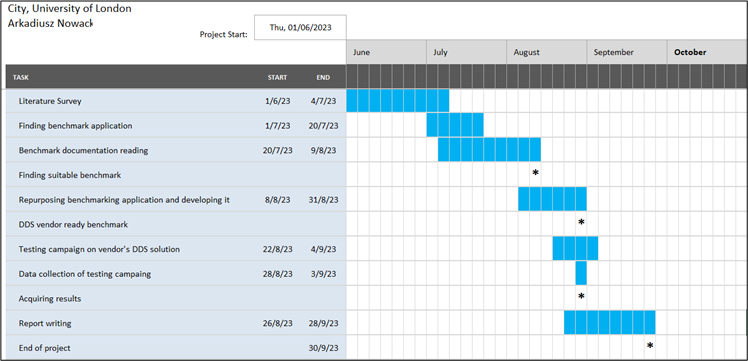

# Experimental Performance Evaluation of Data-Distribution Service software 

**&raquo; Concise report on the findings & generated performance metrics with decomposition and graphical visualization**   _Data Distribution Service_ &middot; _Benchmark application_ &middot; _Performance_ &middot; _Latency_ &middot; _Throughput_

---

Submission of the master's thesis in the 4th year at City, University of London.\
Date: 02/10/2023\
Author: [Arkadiusz Nowacki](https://github.com/ArkadiusN)\
Contributors: **Dr. Vladimir Stankovic**  & **Kaleem Peeroo**

---

### Abstract

The project was undertaken to obtain the results of the testing campaign using a benchmark application based on Data Distribution Service technology. Measurement collection was performed using RTI Perftest on a solution provided by a major distributor of this specification, configured without security features. Relevant components of the available benchmark solution, written by members of the RTI firm and associates, were also adapted for the use of major programming languages. The results present the solution that has achieved valuable performance in the aspect of latency and throughput out of vendors compatible with the adapted version of the test. The value coming from the findings of the research presents performance favourable choices of DDS solutions for researchers and practitioners. Future work is to identify the same measurements further with changes in configuration and with higher variance of DDS solutions.

#### Contents
- **[1 Introduction and Objectives](#1-introduction-and-objectives)**
  - [1.1 Background and Reasoning](#11-background-and-reasoning)
  - [1.2 Aim and Objectives](#12-aim-and-objectives)
  - [1.3 Testable results](#13-testable-results)
  - [1.4 Project Beneficiaries](#14-project-beneficiaries)
  - [1.5 Methods Outline and Project Plan](#15-methods-outline-and-project-plan)
  - [1.6 Changes during project](#16-changes-during-project)
  - [1.7 Project Report Outline ](#17-project-report-outline)
- **[2 Context](#2-context)**  

_Still not finding what you are looking for? Try the [Wikipedia](<https://en.wikipedia.org/wiki/Data_Distribution_Service>)!_

## 1 Introduction and Objectives
### 1.1 Background and Reasoning
The field of Data Distribution Services was initially introduced by the company Real-Time Innovations back in 2001. The company specializes in providing software and services ranging from real-time technology to the Internet of Things, with its primary goal being to maintain low latency and enhance the reliability of its offerings. Over the years, RTI has expanded the scope of their work, enabling them to deliver solutions utilized in vast industries such as automation, healthcare, and energy.

During that time, they initiated the development of specifications for the DDS technology in collaboration with Thales Group. However, a similar initiative was undertaken by another major solution, the Object Management Group (OMG), which worked on its version in 2004 and subsequently released newer versions in 2005, 2007, and 2015, ultimately succeeding in obtaining US patent approval.

During the evolution of connectivity, simple systems required only a basic connection between computers. The concept of scalability was confined to an increase in the number of communication links as machines were continually added. However, this approach eventually faltered once there were enough machines for the links between them to become a significant part of the mechanism. Additionally, these systems started to dominate, obscuring their original goal of a simple and reliable architecture.

In a new phase, a concept emerged involving the addition of a central broker that managed communication between nodes. However, this second iteration introduced issues, including a single point of failure, increased network latency due to the broker's load, and challenges in maintaining the new elements.

The Data Distribution Service (DDS) emerged as a solution to common challenges in real-time and distributed systems used in critical industries, where low latency and data reliability are paramount. For instance, in healthcare, DDS must be flawless for tasks like hospital patient monitoring and facility management, as DDS failures could have significant negative impacts.
Yet, a notable void still exists in a resource that would focus on the domain of Data Distribution Services and present an analysis of the outcomes. Such outcomes would facilitate a comprehensive overview of sets of experimental measurements, considering a scenario where a security feature is either disabled or enabled. This would be presented in a singular/dual resource that encompasses an available solution.

Considering all the information gathered during the preliminary literature review before starting the project, I deliberately chose to undertake this effort. The decision was driven by the recognition of gaps in a subject that is both intriguing and challenging.

## 1.2 Aim and Objectives
The aim of this project is to experimentally evaluate the performance of a set of DDS software solutions and compare their results under the condition of having the security feature disabled and possibly enabled once the viable product of the project is achieved (see Appendix A).

The project has the following objectives:
1. To identify a benchmark application that can be repurposed or enhanced to deploy against at least two of Data Distribution Services without Security-enabled features.

2. To produce experimental measurements for the Data Distribution Services of choice that are analysable, evaluable and subjected to comparison while encapsulated in a report at the end of the project.

3. Desirably use the benchmark application on Data Distribution Services while their additional security configuration is enabled to expand the findings.

## 1.3 Testable results
The project has the following testable results:

1. Software that was repurposed and used to collect information about the DDS solutions from more than one firm.

2. Numerical, tabular/graphical and textual sets of information with the textual evaluation in the form of a comprehensive report.

3. Numerical, tabular/graphical and textual sets of information where the security option has been enabled, changing the overall results and then evaluated textually and encapsulated in the report.

## 1.4 Project Beneficiaries
The beneficiaries of the work consist of three groups (see Appendix A) who gain from having access to the information about the obtained, processed, and analysed performance data of DDS solutions:

1. Research teams within the DDS companies, seeking ways to enhance their DDS solution and become the best solution available in the market, stand to gain financially.

2. Tech industries, including Internet of Things (IoT) businesses that seek to choose the best DDS solution capable of minimizing latency compared to other solutions in the market will distinguish themselves by providing products with the shortest response time. This enhancement will effectively strengthen their customer relations.

3. Programmers who aim to make informed choices to enhance metrics in their data-centric applications.

4. Researchers interested in the performance of publish-subscribe real-time distributed systems.

## 1.5 Methods Outline and Project Plan
For the reason that project results require use of the DDS benchmarking software to gather data for subsequent analysis from both the benchmarking implementor and one competitor, the latter one has to correspond too architecture of the initial vendor. Procedure of developing or adjusting one testing application for the architecture of other DDS provider brings high uncertainty and technical complexity because it was not done before or the resources may be densely limited or acquired under special agreements. The plan for the development adheres to Agile methodology, while activities related to main performance measuring are performed in an iterative and concurrent manner from the middle to end stages of August, what is comparable with Scrum framework for Agile (see Appendix B). Details are for view in the project plan in Figure 0. The predicted consequence of such methodology ought to make design and implementation of test harness possible as well as provide the stability and adaptability during project’s continuity.

<em>Figure 0: Project plan (Milestones are denoted with star sign)</em>

## 1.6	Changes during project
The changes that occurred during the project were primarily limited to insignificant aspects of the project. Extra time, such as additional days, was allocated for certain activities like data collection or report writing. The only notable shift was the minimal software development for another DDS solution, as the original objective was deemed unrealistic given the required resources with the chosen testing software. Some adjustments have been made in the additional files to present the results of the work in the best possible manner, providing maximum details about the outcomes. As a result, configurations of each test were added, along with references and a more detailed ‘Contents’ page in the spreadsheet. Additionally, a library of visualization tools was added to enhance the analysis and comparisons.

## 1.7	Project Report Outline 
The project has been organised as follows:

- $\color{white}{Chapter 2}$ – Context provides theoretical and practical background information covered during the stage of literature review. Chapter brings the view and understanding about the nature of Data Distribution Service, its specification, views on architecture by major implementors and showcases architectures existing before the invention, which are relevant to the research. More importantly, a number of benchmarking software was manifested and testing analyses results acquired by the vendors of DDS. Short section goes into more details about the metrics of such analyses to further inform and remove possible incorrect convictions. Lastly, section also stresses on the importance and benefits of using guidelines on testing campaigns and how the practices organise this activity. 

- $\color{white}{Chapter 3}$ – Methods chapter discusses a variety of approaches and tools utilized throughout different phases of the project life cycle. A key emphasis lies in the iterative and concurrent processes involved in understanding, deploying the benchmarking tool, and conducting comprehensive analysis, ultimately leading to conclusions. This chapter also explores the interactions with all project outputs and methods of informed design process. 

- $\color{white}{Chapter 4}$ -  Results chapter covers the presentation of the project products and the breakdown of separated work segments. The products are shown in numerical and graphical forms in the dedicated sections by exemplifying the order of how they were achieved, with the author's comments delving into details.

- $\color{white}{Chapter 5}$ – Discussion chapter assesses the project's results in relation to the originally defined objectives to determine whether they have been achieved. It offers contextual information for a broader perspective and presents the work undertaken during the project.

- $\color{white}{Chapter 6}$ – Evaluation, Reflections and Conclusions chapter evaluates the project as a whole, examining the objectives, literature, methods, and planning, while also providing information about the implications and potential future work based on the existing foundation.

[[Top 🢁](#contents)]

## 2 Context