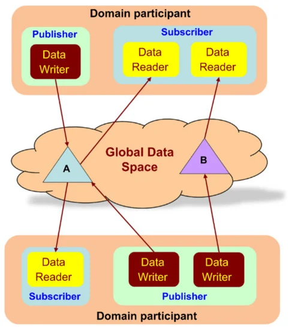
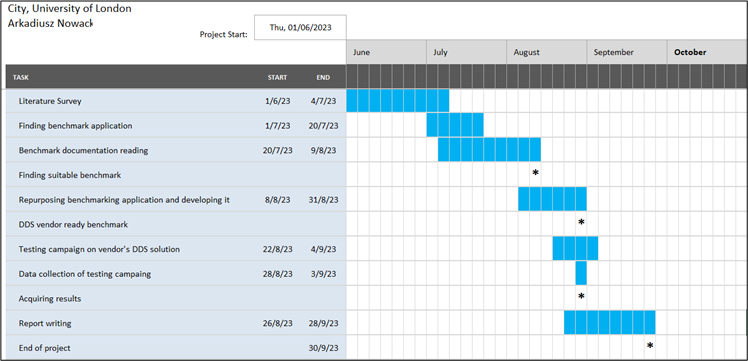
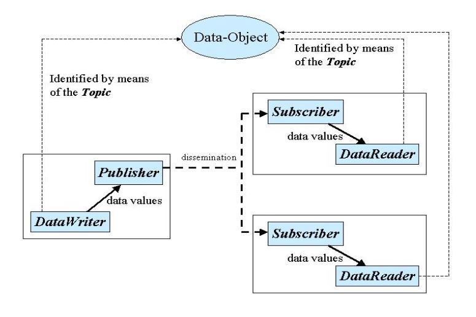
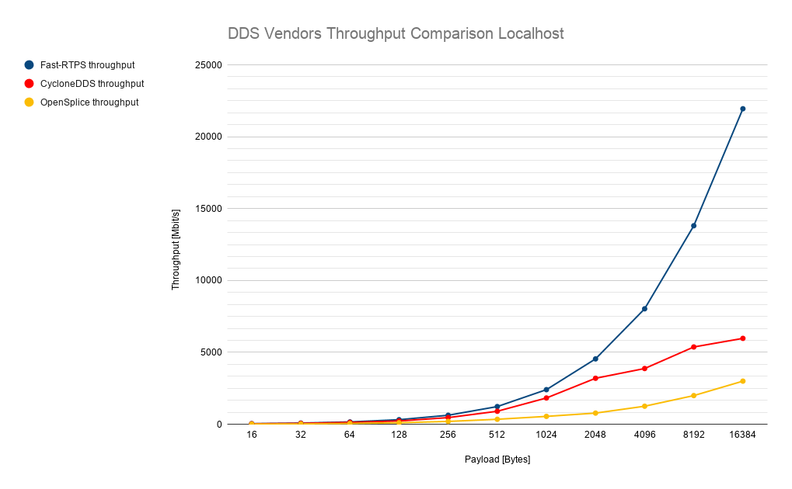
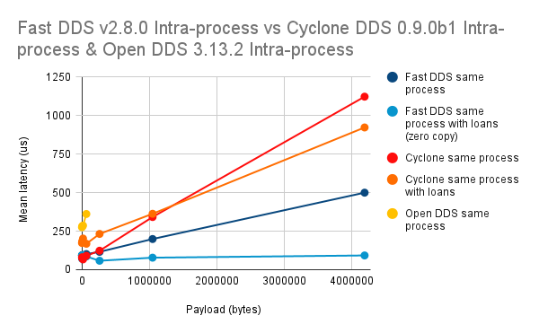
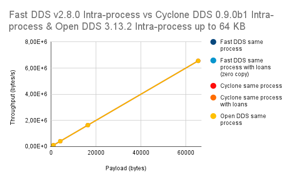
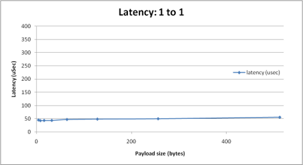
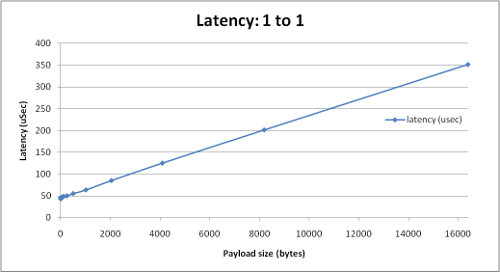

# Experimental Performance Evaluation of Data Distribution Service software

**&raquo; Concise report on the findings & generated performance metrics with decomposition and graphical visualization**   _Data Distribution Service_ &middot; _Benchmark application_ &middot; _Performance_ &middot; _Latency_ &middot; _Throughput_

---

Submission of the master's thesis in the 4th year at City, University of London.\
Date: 02/10/2023\
Author: [Arkadiusz Nowacki](https://github.com/ArkadiusN)\
Contributors: **Dr. Vladimir Stankovic**  & **Kaleem Peeroo**

---

### Abstract

The project was undertaken to obtain the results of the testing campaign using a benchmark application based on Data Distribution Service technology. Measurement collection was performed using RTI Perftest on a solution provided by a major distributor of this specification, configured without security features. Relevant components of the available benchmark solution, written by members of the RTI firm and associates, were also adapted for the use of major programming languages. The results present the solution that has achieved valuable performance in the aspect of latency and throughput out of vendors compatible with the adapted version of the test. The value coming from the findings of the research presents performance favourable choices of DDS solutions for researchers and practitioners. Future work is to identify the same measurements further with changes in configuration and with higher variance of DDS solutions.

#### Contents
- **[1 Introduction and Objectives](#1-introduction-and-objectives)**
  - [1.1 Background and Reasoning](#11-background-and-reasoning)
  - [1.2 Aim and Objectives](#12-aim-and-objectives)
  - [1.3 Testable results](#13-testable-results)
  - [1.4 Project Beneficiaries](#14-project-beneficiaries)
  - [1.5 Methods Outline and Project Plan](#15-methods-outline-and-project-plan)
  - [1.6 Changes during project](#16-changes-during-project)
  - [1.7 Project Report Outline ](#17-project-report-outline)
- **[2 Context](#2-context)**  
  - [2.1 Data Distribution Service](#21-data-distribution-service)
    - [2.1.1 What is "Data Distribution Service"?](#211-what-is-data-distribution-service)
    - [2.1.2 OMG Data Distribution Service specification](#212-omg-data-distribution-service-specification)
    - [2.1.3 DDS as the solution](#213-dds-as-the-solution)
    - [2.1.4 Research gap in performance analysis of the DDS](#214-research-gap-in-performance-analysis-of-the-dds)
  - [2.2 Alternative architectures](#22-alternative-architectures)
    - [2.2.1 Message-oriented middleware](#221-message-oriented-middleware)
    - [2.2.2 Procedural middleware](#222-procedural-middleware)
    - [2.2.3 Transactional middleware](#223-transactional-middleware)
  - [2.3 Distributed systems performance measures](#23-distributed-systems-performance-measures)
    - [2.3.1 Latency](#231-latency)
    - [2.3.2 Throughput ](#232-throughput)
  - [2.4 State-of-the-art in performance assessment of DDS](#24-state-of-the-art-in-performance-assessment-of-dds)
    - [2.4.1 Real-Time Innovations performance testing guide](#241-real-time-innovations-performance-testing-guide)
    - [2.4.2 Existing performance testing analyses of DDS](#242-existing-performance-testing-analyses-of-dds)
  - [2.4.3 Benchmarking applications](#243-benchmarking-applications)
- **[3 Methods](#3-methods)** 

_Still not finding what you are looking for? Try the [Wikipedia](<https://en.wikipedia.org/wiki/Data_Distribution_Service>)!_

## 1 Introduction and Objectives
### 1.1 Background and Reasoning
The field of Data Distribution Services was initially introduced by the company Real-Time Innovations back in 2001. The company specializes in providing software and services ranging from real-time technology to the Internet of Things, with its primary goal being to maintain low latency and enhance the reliability of its offerings. Over the years, RTI has expanded the scope of their work, enabling them to deliver solutions utilized in vast industries such as automation, healthcare, and energy.

During that time, they initiated the development of specifications for the DDS technology in collaboration with Thales Group. However, a similar initiative was undertaken by another major solution, the Object Management Group (OMG), which worked on its version in 2004 and subsequently released newer versions in 2005, 2007, and 2015, ultimately succeeding in obtaining US patent approval.

During the evolution of connectivity, simple systems required only a basic connection between computers. The concept of scalability was confined to an increase in the number of communication links as machines were continually added. However, this approach eventually faltered once there were enough machines for the links between them to become a significant part of the mechanism. Additionally, these systems started to dominate, obscuring their original goal of a simple and reliable architecture.

In a new phase, a concept emerged involving the addition of a central broker that managed communication between nodes. However, this second iteration introduced issues, including a single point of failure, increased network latency due to the broker's load, and challenges in maintaining the new elements.

The Data Distribution Service (DDS) emerged as a solution to common challenges in real-time and distributed systems used in critical industries, where low latency and data reliability are paramount. For instance, in healthcare, DDS must be flawless for tasks like hospital patient monitoring and facility management, as DDS failures could have significant negative impacts.
Yet, a notable void still exists in a resource that would focus on the domain of Data Distribution Services and present an analysis of the outcomes. Such outcomes would facilitate a comprehensive overview of sets of experimental measurements, considering a scenario where a security feature is either disabled or enabled. This would be presented in a singular/dual resource that encompasses an available solution.

Considering all the information gathered during the preliminary literature review before starting the project, I deliberately chose to undertake this effort. The decision was driven by the recognition of gaps in a subject that is both intriguing and challenging.

## 1.2 Aim and Objectives
The aim of this project is to experimentally evaluate the performance of a set of DDS software solutions and compare their results under the condition of having the security feature disabled and possibly enabled once the viable product of the project is achieved (see Appendix A).

The project has the following objectives:
1. To identify a benchmark application that can be repurposed or enhanced to deploy against at least two of Data Distribution Services without Security-enabled features.

2. To produce experimental measurements for the Data Distribution Services of choice that are analysable, evaluable and subjected to comparison while encapsulated in a report at the end of the project.

3. Desirably use the benchmark application on Data Distribution Services while their additional security configuration is enabled to expand the findings.

## 1.3 Testable results
The project has the following testable results:

1. Software that was repurposed and used to collect information about the DDS solutions from more than one firm.

2. Numerical, tabular/graphical and textual sets of information with the textual evaluation in the form of a comprehensive report.

3. Numerical, tabular/graphical and textual sets of information where the security option has been enabled, changing the overall results and then evaluated textually and encapsulated in the report.

## 1.4 Project Beneficiaries
The beneficiaries of the work consist of three groups (see Appendix A) who gain from having access to the information about the obtained, processed, and analysed performance data of DDS solutions:

1. Research teams within the DDS companies, seeking ways to enhance their DDS solution and become the best solution available in the market, stand to gain financially.

2. Tech industries, including Internet of Things (IoT) businesses that seek to choose the best DDS solution capable of minimizing latency compared to other solutions in the market will distinguish themselves by providing products with the shortest response time. This enhancement will effectively strengthen their customer relations.

3. Programmers who aim to make informed choices to enhance metrics in their data-centric applications.

4. Researchers interested in the performance of publish-subscribe real-time distributed systems.

## 1.5 Methods Outline and Project Plan
For the reason that project results require use of the DDS benchmarking software to gather data for subsequent analysis from both the benchmarking implementor and one competitor, the latter one has to correspond too architecture of the initial vendor. Procedure of developing or adjusting one testing application for the architecture of other DDS provider brings high uncertainty and technical complexity because it was not done before or the resources may be densely limited or acquired under special agreements. The plan for the development adheres to Agile methodology, while activities related to main performance measuring are performed in an iterative and concurrent manner from the middle to end stages of August, what is comparable with Scrum framework for Agile (see Appendix B). Details are for view in the project plan in Figure 0. The predicted consequence of such methodology ought to make design and implementation of test harness possible as well as provide the stability and adaptability during project’s continuity.

<em>Figure 0: Project plan (Milestones are denoted with star sign)</em>

## 1.6 Changes during project
The changes that occurred during the project were primarily limited to insignificant aspects of the project. Extra time, such as additional days, was allocated for certain activities like data collection or report writing. The only notable shift was the minimal software development for another DDS solution, as the original objective was deemed unrealistic given the required resources with the chosen testing software. Some adjustments have been made in the additional files to present the results of the work in the best possible manner, providing maximum details about the outcomes. As a result, configurations of each test were added, along with references and a more detailed ‘Contents’ page in the spreadsheet. Additionally, a library of visualization tools was added to enhance the analysis and comparisons.

## 1.7 Project Report Outline 
The project has been organised as follows:

- $\color{white}{Chapter 2}$ – Context provides theoretical and practical background information covered during the stage of literature review. Chapter brings the view and understanding about the nature of Data Distribution Service, its specification, views on architecture by major implementors and showcases architectures existing before the invention, which are relevant to the research. More importantly, a number of benchmarking software was manifested and testing analyses results acquired by the vendors of DDS. Short section goes into more details about the metrics of such analyses to further inform and remove possible incorrect convictions. Lastly, section also stresses on the importance and benefits of using guidelines on testing campaigns and how the practices organise this activity. 

- $\color{white}{Chapter 3}$ – Methods chapter discusses a variety of approaches and tools utilized throughout different phases of the project life cycle. A key emphasis lies in the iterative and concurrent processes involved in understanding, deploying the benchmarking tool, and conducting comprehensive analysis, ultimately leading to conclusions. This chapter also explores the interactions with all project outputs and methods of informed design process. 

- $\color{white}{Chapter 4}$ –  Results chapter covers the presentation of the project products and the breakdown of separated work segments. The products are shown in numerical and graphical forms in the dedicated sections by exemplifying the order of how they were achieved, with the author's comments delving into details.

- $\color{white}{Chapter 5}$ – Discussion chapter assesses the project's results in relation to the originally defined objectives to determine whether they have been achieved. It offers contextual information for a broader perspective and presents the work undertaken during the project.

- $\color{white}{Chapter 6}$ – Evaluation, Reflections and Conclusions chapter evaluates the project as a whole, examining the objectives, literature, methods, and planning, while also providing information about the implications and potential future work based on the existing foundation.

[[Top 🢁](#experimental-performance-evaluation-of-data-distribution-service-software)]

## 2 Context
### 2.1 Data Distribution Service
#### 2.1.1 What is “Data Distribution Service
Sim, W., Song, B., Shin, J. and Kim, T. (2021, p. 1) defined the Data Distribution Service (DDS) to be a “standard in the publish–subscribe form” as well as the “data-centric middleware”. In the same way both of these definition are supported by the application programming interfaces of the providers in a way consistent with a purpose of serving as a standards for time and task-critical applications. The same context can be understood by looking at elementary, common mechanism in the society, being a subscriber to a newsletter. The only drawback in this comparison would be the potential consequence of subscribers not receiving requested information, as with this technology, it may lead to unfavourable outcomes. According to the DDS-Foundation, in a distributed system, there is a need for the middleware in the whole software architecture that would be a link between the operating system and applications (DDS Foundation, 2023). The result of middleware taking this role is to allow easier communication and data sharing as well as taking accountability from the software developers to allow them save time on information passing between the systems and application. 

The idea had the potential to function as it was highly supported by implementation technologies, while discarding the low-level details that would act as obstacles according to quote provided by Object Management Group (DDS Foundation, 2023) “abstracts the Application from the details of the operating system, network transport, and low-level data formats. The same concepts and APIs are provided in different programming languages allowing applications to exchange information across operating systems, languages, and processor architectures”. The analogy mentioned before explains the further concepts that complements entire specification, as there is a publisher, subscriber, global data space, topic, data reader, data writer and QoS (Quality of Service). Naturally, when person subscribes to a newsletter, there should  be a possibility to access a space where the information (topic) of interest, is available and follows predefined quality standards. As the person accesses the data, the role within is to read data, while publisher sending the newsletter writes data to the space of general access that then is observed by viewer.  In accordance with what is published about DDS, there are many topics that can appear in the domain, and all of them are shareable across many subscribers while it may happen that some are not of anyone’s interest.  All of the above ideas are shared in most definitions, however, they may add extra details which offer deeper functionalities, such as a filter (see Figure 1) where only a subset of data inside the topics is published or when the reader wants to have a view of a chunk of information available under a topic. According to Woongbin, there is a possibility to accept both roles where participant is split between being a reader and publisher in the global space with multiple “data writers” or “data readers” (see Figure 2). 

#### 2.1.2 OMG Data Distribution Service specification
To expand upon the definition of Data Distribution Service, it is worth examining the comprehensive and detailed specification provided by the pioneer in the development and definition of this technology, which is the Object Management Group (OMG).
The specification describes the DDS technology with a more extensive definition of being a data-centric publish-subscribe model (DCPS). Data centricity can be understood based on the business definition provided, which is “It is at the heart of the Enterprise’s operations; in fact, the entire IT and business architecture is built keeping in mind the fact that data is a prime and permanent asset” (Express Analytics, 2019). As the evidence suggests, the definition of such acknowledges the value of the data in the model while being affixed to the communication happening between two parties, which is also supported by statement, “At its core, data-centricity acknowledges data’s valuable and versatile role in the larger enterprise and industry ecosystem and treats information as the core asset to enterprise architectures” (Doubleday, K., 2020). Equally important, the mindset or trend around data needs to be supported by powerful APIs and defined schemes to facilitate the expected high performance and predictability of outcomes followed by smart usage of available limits. To support the goals set for this model, the Object Management Group (p. 1, 2015) has identified the points about the interfaces that ought to be followed, such as:

-	Make middleware to pre-allocate resources to ensure limited usage of dynamic resource allocation, which can negatively impact the usage of limits/performance. 
-	Properties must be limited to ones that do not include the utilisation of limitless as well as hardly-predictable resources.
-	Try not to make copies of data, especially when it is unnecessary

As can be predicted, many real-time applications may require communication based on data centricity as the main parties exist and are of important roles. The roles follow the same convention as Sim Woongbin described, being a supplier of data who makes it useful to remote applications. The model of the DCPS has become strong as the problems with scalability and flexibility of distributed shared memory were inevitable, especially through the network where it was difficult to implement. The global data space concept was promoted in the new model, same as the option for the applications to send batches/streams of data to this space while others derived from it (see Figure 3). The encapsulation of this method and definitions is that “Underlying any data-centric publish-subscribe system is a data model. This model defines the global data space and specifies how Publishers and Subscribers refer to portions of this space. The data model can be as simple as a set of unrelated data structures, each identified by a topic and a type. The topic provides an identifier that uniquely identifies some data items within the global data space”. The OMG (p. 1, 2015) group believes the industries that are appropriate for the model are ones to have applications in real-time with selective approach to the information, for example:
-	Industrial automation
-	Distributed control systems (DCS)
-	Distributed simulation systems (potentially interactive, named DIS)
-	Telecommunication equipment control
-	Sensor networks (WSNs)
-	Network management systems (NMS) 

Industries such as that require that overhead be controlled in a way that keeps it at the lowest possible level, as it is the main concern for real-time systems, which have policies supporting it. The connection to Quality of Service is that they are helping in the management of not unlimited resources and their allocation. It turns out that the placement of these limits will be at the same position as the most crucial requirements of the application. Furthermore, these policies work in the best interest where settled, consequently affecting the predictability, overhead, and resource utilization. The other matter currently popular in many fields is scalability, which grows at least perpendicularly or perhaps even exponentially based on the size of the current architecture. In the case of hundreds of publishing and subscribing nodes, the initial manner in which the application was built needed to be carefully planned. It is also a common practice, where the systems provided by these industries need to be of large scale initially, so planning has to be advanced and thought through.

#### 2.1.3 DDS as the solution
The emergence of DDS stemmed from the shortcomings of point-to-point middleware technologies that were previously favoured for real-time and distributed systems. As data complexity increased, so did the need for communication links to connect numerous machines exchanging information. This often led to complex spider/tree diagram-style systems, which required continual expansion to accommodate additional tasks.

To maintain performance and reliability, programmers had to develop custom communication links and interfaces. While these efforts were initially successful, they resulted in inflexibility and challenges when connecting to external systems or adding/removing components. For instance, companies like PrismTech and NEXTEL faced difficulties in working on their High-Level Architecture (HLA) distributed Simulations (Investment Weekly News, 2011) due to these issues. The systems needed to scale without becoming overly complex, all while ensuring high-quality service, including guaranteed delivery, reliability, and high throughput.

Similarly, a structure was needed to prevent performance bottlenecks during communication. RTI also noted that "Most systems are not designed for rapid integration and easy evolution" (Real-Time Innovations, p. 1, 2020). Connectivity solutions designed for simple systems struggled as user needs expanded. These solutions resulted in increased debugging complexity and made it challenging to develop and understand overlapping components.
It became evident that the existing connection links played a significant role in these problems, prompting the search for new solutions. The central broker emerged as a potential solution but had limitations, particularly concerning single points of failure and increased latency under heavy loads. The maintenance and resource requirements of this broker outweighed its advantages.

The introduction of the publishing-subscribing methodology, centered around a central Pub/Sub Broker, offered an alternative. This approach eliminated the need for explicit connections and streamlined node additions. It prioritized tasks using queues and Quality of Service (QoS) parameters. The concept of a global data space shifted from the broker to a databus, where endpoints acted as “logical peers to a Databus” (Real-Time Innovations, 1:43, 2020) while the “communication software resident in each endpoint controls the behaviour and communication on the data-centric bus”. 

This shift in approach addressed issues related to security, scalability, and decentralization, making them more manageable and relevant for future system expansion. 

#### 2.1.4 Research gap in performance analysis of the DDS
There exist many articles or dedicated documentation about the performance in regards to latency and throughput that target the DDS solution provided by the given vendor. eProsima, as an expert in providing middleware solutions, only tackles some DDS solutions available outside of their Fast-DDS (eProsima, 2019) and presents the results of benchmarking for teams such as ADLINK IST, which has launched the Eclipse Cyclone DDS (2023) project and the previous OpenSplice DDS (ADLINK IST, 2023) (see Figure 4). The repository shows the latency and throughput of the mentioned projects. However, in contrast, the information does not include major vendors such as TwinkOaks Computing CoreDX DDS or RTI DDS. The result is outdated information, which has most likely lost its value.

Secondly, there exists a research gap that could outline, or at least lead to, new conclusions or informed decisions when considering the utilization of such technology. It can be argued that no research paper would make a qualitative comparison between at least two solutions and showcase the results in a more advanced and detailed fashion. Here, both numerical and graphical data will be present together with analysis, proceeding findings, and conclusions.

[[Top 🢁](#experimental-performance-evaluation-of-data-distribution-service-software)]

### 2.2 Alternative architectures
#### 2.2.1 Message-oriented middleware
The definition of the Data Distribution Service as middleware protocols supported by API standards is not the sole solution for distributed systems handling important tasks with a primary focus on data. The first option available is the message-oriented middleware family, taking the role of the main controller of communication. The operation of this architecture is possible due to the utilization of messages that act as little pieces of information serving specific functionality, such that one can receive warnings about their distributed system (if that’s the function of interest). It can be likened to a data packet with supplementary information, similar to a browser cookie, which serves a particular purpose when required. However, in this architecture, its usage may be frequent. Companies like IBM and Oracle adopted the architecture in their technology, supporting MQSeries and Java Message Queue.

The reason that many benefit from the alternative is its use case for queued asynchronous service that brings many advantages in some way comparable to the PubSub solution, including fault tolerance, priority, scalability with client-server decoupling, and transparency for group communication (Nunn, R., p. 3, 2003). Although these are factual observations, Robert Nunn pointed out concerns such as a lack of transparency, heavy reliance on message queuing, and the necessity for programmers to develop a significant amount of marshalling code, which can become unwieldy.

#### 2.2.2 Procedural middleware
Besides, the second middleware solution responds directly to the Remote Procedure Calls (RPC) requirements, where both sending and receiving are a go-to action. The communication established with the RPC can be compared to standard message passing; there needs to be a client and a distant server for the execution of procedures. An important note is that the actions of the middleware are supported by the protocols corresponding to this software communication, so the methodology can persist. Additionally, if someone needs this type of communication for their case, there exist plenty of adoptions for popular operating systems and programming languages, so the client can use whatever is available for them. In the same case, the distant server can use Interface Definition Language (IDL) for compilation of client and server network communication, consequently performing actions like marshalling and unmarshalling (Nunn, R., p. 3, 2003). Based on all of the definitions, the evident advantages range from the simplicity of implementation, cross-platform possibilities, and familiarity with what the code and implementation look like. However, as with the previous architecture, it has some disadvantages, such as a lack of multicast, no definition for asynchronous communication, and no scalability, among others. The problems specified, together with fault tolerance and extra complexity due to no definitive load balancing methods in many cases, are seen as impractical. 

#### 2.2.3 Transactional middleware
Lastly, there is a middleware that functions more than an exclusive extension to some other middleware. The function of this technology is about transactions going through multiple hosts. According to Robert Nunn, there needs to be assurance that the operation will happen either on all of the system’s hosts or on none of them to support consistency. To make sure that this happens, a two-phase commit protocol is implemented. In simple terms, the first phase is designed to ensure that all nodes can confirm whether they can submit or not. The second phase involves committing to the transaction if they are ready, based on what was established previously. In summary, it allows the database to integrate into the state of the management system, and vice versa. While it allows both synchronous and asynchronous communication, it is often the case that the middleware is overhead due to the focus on making transactions precise and in accordance with desired outcomes. The major issue with this technique arises in situations where one transaction can halt other transactions, and the time taken rises accordingly with the complexity of the blocking transaction. As explained by these points, it seems that there are advantages to using this middleware for transactions with competent precision, but the issues may accumulate with complexity and user needs. 

[[Top 🢁](#experimental-performance-evaluation-of-data-distribution-service-software)]

### 2.3 Distributed systems performance measures
#### 2.3.1 Latency 
The basic understanding of the delay during the travel of data packets from the source entity to a distant final destination is called latency. It has been known since the early stages of technology development, dating back to the initial periods of telephony and telegraphy. From those times, it has gained more attention than ever, as a direct consequence of the enhancement of computer networks, data processing, and communication systems. The main task associated with latency was the effort to reduce it so that the party with a much slower, perhaps worse setup, can still enjoy the analogous benefits of usage. It has expanded its definition to include “the amount of time it takes from when a request is made by the user to the time it takes for the response to get back to that user.” This definition somehow conveys the current situation better due to the rarer ownership of one-way communication rather than an exchange (Mozilla.org, 2023). Furthermore, this exchange between entities can be affected by multiple factors, as simple as the type of network protocol, network delay, internet connection, latency of the asset, complexity of the request, etc. Most importantly, the procedure of the delay might come in two forms, where one is openly the time taken to send a request, whereas the other includes environmental aspects such as the time taken to send a request and get back the results in the browser. Nevertheless, the round-trip may also include the time taken by such an exchange with additional time for the framework to perform requested activities together, making sure there are no exclusions in the metrics. Junjie Wu, Wei Chen, and Anthony Ephremides (p. 4453, 2023) have observed a spike in the popularity of providing extremely low latency in communication. In many cases, such as autonomous driving, smart grids, and the Industrial Internet of Things, the promise it brings for further development can be highly beneficial. 

#### 2.3.2 Throughput 
The measure of throughput was identified by John Burke (2022) as how many units of data the system can process in a specific period (also referred to as the processing of data through a channel). The definition of this concept was already in place in the mid-20th century when the first data communication was developed. The context in which throughput was highly encountered by engineers and computer scientists was the processing of data at specific rates, as it was the main concern to optimize speed and make the system reliable. Network throughput, as the amount of data moved from one destination to another in usually one second, is measured using bits per second (bps) and can expand to megabits per second (Mbps) or gigabits per second (Gbps). An important note is that the difference between throughput and bandwidth can be shortened to relations such that throughput is the amount of data while bandwidth is the capacity of the network for that data (moved once). 

[[Top 🢁](#experimental-performance-evaluation-of-data-distribution-service-software)]

### 2.4 State-of-the-art in performance assessment of DDS
#### 2.4.1 Real-Time Innovations performance testing guide
To gain insights into the performance of our DDS, the testing campaign team must adhere to predefined procedures and have a well-prepared plan to obtain values that are both realistic and answer to the constraints of the environment. With such a demeanour, the values will become understandable under their conditions and truthful to what could be obtained in the best case. Real-Time Innovations has outlined that a team of people performing the test may not be fully aware of what they are indeed looking for, as their understanding may not correspond to the correct definition. An example of the misconstrued definition they believe is “fast,” as the performance is directly affected by the real world working with the system. The word mentioned comes in two measurements, which are often of equal importance (however, some may favour one over the other), and they are throughput and latency. Throughout may look like “shall handle M thousand Ys per second,” while latency can be taken as “shall do X functionality in N milliseconds” (Real-Time Innovations, p. 1, 2021), and the combination of both results in loaded latency. As they are precisely defined, this understanding is valuable, as we can take it and be more likely to come across a certain system with deterministic behaviour. 

Testing of the performance is a natural process on the finished or continuously developed product, as the potential users can identify whether the DDS product meets the functional and non-functional requirements for their time-critical or distributed system. Finding the right solution with a benchmark may seem to be a simple step, where we can plot the performance of many solutions and see which one is the best through a defined time frame. On the contrary, such a task is often "complex and non-trivial", and people often decide to look for paid support from a company that offers such services to be done in an informative and fair manner. The main issue of performing the tests on our own is the fact that based on looking for the 'best' solution, this keyword and the results described by it may not be of much value. In order to get the latency, which is relatively at the lowest point, or on the other hand, throughput that is at its peak, our system would have to sacrifice nearly all network bandwidth or CPU. In contrast, the system performing in the real environment would likely never act in the way where most of the resources are taken, but certainly, the users of the DDS want the middleware to perform better than what they factually need in their system. 

Real-Time Innovations (pp. 2-3, 2021) has conducted an analysis of the testing code across various use cases and has pinpointed the following additional issues:

-	Tests for both latency and throughput often involve the execution of the testing framework's logic, leading to imprecise and inaccurate results. Ideally, these tests should solely measure the time the middleware consumes.

-	Test comparisons are frequently affected by differences in computer clock times, where even a single microsecond variance can significantly impact the results. Achieving precise measurements in microseconds is nearly impossible due to the challenges of clock synchronization.

-	To account for test overhead in throughput and end-to-end latency assessments, specialized hardware is often required. Unfortunately, such hardware is not readily available to general users or small businesses.

-	There is a lack of knowledge regarding optimal middleware configuration to ensure tests are conducted on the most high-performing components.

-	Given that the technology is relatively new to many users, they may configure the middleware sub-optimally for testing or be unaware of how to fine-tune it for specific scenarios. Additionally, middleware settings are typically preconfigured with default values that are often suboptimal for performance testing.

Consideration of the latter points makes the definition of correct practices much simpler. Therefore, the performance designing guide is defined by the four key activities. The first activity that should be of importance is to define the performance test scenario in which the goals are outlined. These goals could span from reaching the maximum potential of the response time to having an average limit of acceptance to make the results easily interpretable. Secondly, it ought to be a natural step to make the tests realistic in their nature by using the same hardware, platforms, payload sizes, and operating systems for the need of comparability. The same context applies to the components of the network, ranging from the network switch, cabling, modem, or computer’s network interface card, where the incorrect/various configurations may result in disparities in measurements. Thirdly, there is pressure put on the correct middleware configuration as well as the familiarity of the parameters that play a major role in the correct setting for either best latency or best throughput (Community Real-Time Innovations, 2022). Based on the list of parameters and their description, it should be intuitive what to choose from for a given setting. On the contrary, the options for testing do not end there, and they can be expanded together with configuration for more advanced checks, such as multiple network interfaces and more. To summarize, the values we collect should not be analysed in the most basic tact but rather looked at from distinct perspectives. These perspectives may take into account averages, maximum, minimum, amplitude, outliers, standard deviation, or choice of specific percentile as the specified point in the batch of data. 

#### 2.4.2 Existing performance testing analyses of DDS
It is not uncommon practice to look for information about the measurements related to the technology we are planning to use in the future. For obvious reasons, every company or individual wants to use their financial resources for the most modern and reliable solution for the given problem. Such a decision can be strengthened by the information gathered from the online communities that have reviewed the pros and cons of given technology and displayed performance graphically or textually. However, information of this type might not be updated periodically and may be biased by the likelihood of a person previously working for the solution owner. It is a good practice to go to the dedicated pages provided by the vendors to get to know more about the limited number of commercial and open-source implementations of DDS. Usually, there are available testing campaigns for the general audience as well as potential new partners. The consequence of this is getting various information about the performance in both latency, throughput, and possibly additional context, like CPU utilization. On the contrary, it is wise to consider such information with scepticism, as the company may want to put their solutions in a better light. 

The first company presenting its testing campaign is eProsima which has displayed the results of their open source project, FastDDS. The information suggests that their implementation has a large set of features, quality documentation and unbeatable performance that will be proved by this activity (eProsima, 2022). In addition, to confirm these claims a comparison has been made between their middleware with competing OpenDDS and CycloneDDS. The first test was done on latency, which can be understood as the time delay between messages going through the system, for example from the publisher to the subscriber. Testing was done under the condition of being an intra-processing type, which is simply an accelerator for the communication happening between two parties in the same process. 

After examining FastDDS in the same process and FastDDS in the same process with loans, it was found that the 'mean latency' was the lowest among all DDS solutions as the payload size increased from one million to four million bytes (see Figure 5). However, the throughput, which measures how much information can be sent or received, followed a similar trend to other middleware (see Figure 6).

The second set of tests was conducted by TwinkOaks Computing on their implementation of CoreDX DDS, which claims to strike a perfect balance between performance and resource usage. They emphasize that their product can be seamlessly implemented on the consumer's side without incurring additional costs related to maintenance and ownership.

On their dedicated testing page, they focus on evaluating a single product available in the market. They aim to substantiate their claims by examining the metrics obtained. TwinkOaks asserts that “the numbers show that CoreDX DDS can outperform most other communication infrastructures, including those self-proclaimed "leaders"” (TwinkOaks Computing, 2017).

However, challenges arise when comparing their “Latency: 1 to 1” test with the tests conducted by eProsima. The test definitions lack conventional settings, as they primarily examine payload sizes in bytes but on a much smaller scale (hundreds instead of millions, with an expansion to thousands in the next graph). Additionally, the definition of latency is marked as 'uSec,' although the scale appears similar, it lacks mean values.

Furthermore, the tests provided for CoreDX may be comparable to the previously seen checks on the intra-process (see Figure 5), where the purple and blue indicators might align. However, this comparison would require adjustments to incorporate 'mean' values and the same scale (see Figures 6 & 7).

The evidence may suggest that the disparity between the results could compel beneficiaries to invest time and resources in accurately converting and comparing these results for further analysis. The likelihood of this effort increases when comparing a higher number of technologies, given the multitude of options available for high-performance and real-time applications.

However, it's important to note that comparing results is not straightforward, even with the introduction of newly defined scales and values. Several factors influence these metrics, including software, hardware, methodologies, configuration setups, choices of what to measure, and customization of tests by middleware vendors.

An efficient approach to achieving a meaningful and truthful comparison is to maintain a consistent testing environment and establish a global standard for testing. Such a standard would outline all the details of middleware testing. Until such action happens, the implication is such that the CoreDX and Vortex OpenSplice DDS have switch providers from Netgear and Dell, and they do not match versions of the Linux operating system for their tests, where one is "Linux 3.8.13-rt14.20.el6rt.x86_64" and the other "Linux 2.6 x86" (ADLINK IST, 2021).

#### 2.4.3 Benchmarking applications
In 2020, Howard Wang (Community Real-Time Innovations, 2020) discussed the availability of benchmarking applications in his company for testing alternative solutions. Depending on the technology chosen, there are likely testing applications available for measuring latency and throughput, and these may be subject to expansion or modification. During the discussion, several third-party methods for measurement were outlined, along with mentions of company-specific software. However, a significant challenge is that only a few entities provide access to the complete source code, and even fewer offer documentation for enhancements, including tutorials or detailed documentation. Occasionally, you may come across a DDS benchmark that is outdated and no longer under development. 

The central theme of the RTI Perftest is its engagement with the open-source community, intending to improve the project (Community Real-Time Innovations, 2022). According to the GitHub repository, this software operates through the command line and allows for the measurement of minimal latency and maximum throughput, along with parameters for conducting further tests. When executed, the software establishes communication between participants in the Perftest. The key components are the subscriber and publisher. The publishing side writes data as quickly as possible, following predetermined configurations set by parameters. During communication, some of the data samples serve as 'echos', which are sent to the opposite side to calculate round-trip time latency, subsequently dividing it by half. Another important feature is the option to run multiple instances of the application, enabling the user to adjust the number of subscribers while keeping the publisher on a single node. The publishing application publishes throughput data while simultaneously subscribing to latency responses. The same scenario occurs in the opposite direction, with the publishing of latency echos. Ultimately, the user retrieves test results for latency (via the publisher) and throughput (via the subscriber). 

An important company like eProsima conducted numerous tests in 2022 to gather results for their flagship product, Fast-RTPS DDS. To obtain these results, they utilized the “Fast-RTPS Automated Benchmarking” tool available on GitHub (eProsima, 2023). This tool displays metrics graphically and was made possible through the use of frameworks such as “Apex” and “iRobot”. The former employs 'Python' scripts, while the latter uses 'xml' utilities. The structure of this minimalistic project offers notable advantages, as it incorporates Continuous Integration pipelines, enabling straightforward deployment, execution, and report generation. However, the documentation is limited to the main 'readme' file and subsequent documents for both frameworks. These documents do not provide specific details on how testing was conducted for Fast-RTPS but instead direct users to the general documentation for iRobot and Apex.

Third solution that had its prime from 2005 to 2008 is the DDS Benchmarking Environment (DBE), developed by James Edmondson and the R&D team (Vanderbilt, 2020). This tool was primarily used for testing solutions like OpenSplice, MPC Build, or RTI 4.1e towards the end of its operational period. The development of this tool, during the early stages of DDS expansion, involved the use of Pearl scripts for automotive tests on a distributed network. The research received technical support from companies ranging from Real-Time Innovations, PrismTech Inc., to Object Computing Inc. The software could be easily executed via a secure shell to launch publishers and subscribers. Once this step was completed, interaction coordination was handled by the code to continuously log batches of data. The tool's versatility allowed for the collection of information regarding throughput, CPU, and memory usage, although there was no indication of latency testing in the documentation. Despite its early development and plans for expansion in Quality of Service (QoS) and configuration for durability, reliability vs. best effort, and latency budget, DBE has become an abandoned project. Unfortunately, the project directory now serves only as a reference and does not offer a deeper explanation of the technology.

At last, the open-source project DDSBench, by Yu Sheng (2018), who is an employee of PrismTech, also known as ADLINK IST, is the solution available in the open-source library written in the C language. The project has disadvantages in the form of no documentation and no continued support, finished in 2018. It follows the same principles as the previous competitors in the space, meaning that the code corresponds to the idea of communication taking place between subscribers and publishers. This can be seen by an analysis of the “throughput” and “roundtrip” portions of the code while displaying the clear steps in collecting information about latency and throughput. It is possible that the project was quite useful at the time of development and commitment to it, but at the moment, it can be associated with the main problem of being abandoned. 

[[Top 🢁](#experimental-performance-evaluation-of-data-distribution-service-software)]

## 3	Methods
Chapter outlines the methods and software tools employed throughout the project's duration for collecting, analysing, cleaning, and visualizing the information acquired from performance-related activities. It also includes the development process of the benchmarking plugin, discussing its implementation.
