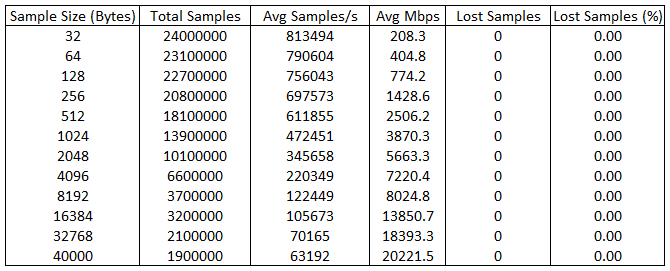
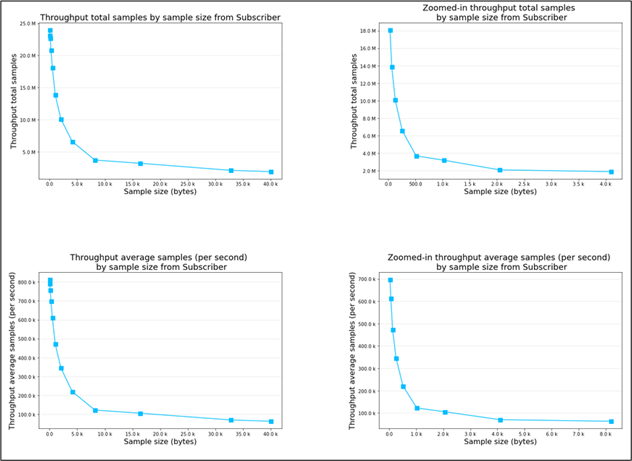
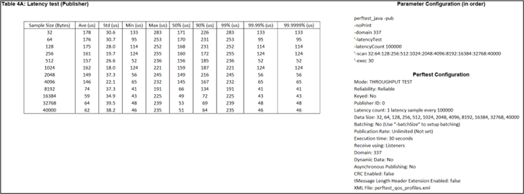

# Experimental Performance Evaluation of Data Distribution Service software


**&raquo; Concise report on the findings & generated performance metrics with decomposition and graphical visualization** <br/><sub> _Data Distribution Service_ &middot; _Benchmark application_ &middot; _Performance_ &middot; _Latency_ &middot; _Throughput_</sub>

---

Submission of the master's thesis in the 4th year at City, University of London.\
Date: 02/10/2023\
Author: [Arkadiusz Nowacki](https://github.com/ArkadiusN)\
Project Mark: 68%\
Contributors: **[Dr. Vladimir Stankovic](https://www.city.ac.uk/about/people/academics/vladimir-stankovic)** & **[Kaleem Peeroo](https://www.researchgate.net/profile/Kaleem-Peeroo)** & **[Javier Morales Castro (RTI)](https://community.rti.com/users/jmorales)**

---

### Abstract

The project was undertaken to obtain the results of the testing campaign using a benchmark application based on Data Distribution Service technology. Measurement collection was performed using RTI Perftest on a solution provided by a major distributor of this specification, configured without security features. Relevant components of the available benchmark solution, written by members of the RTI firm and associates, were also adapted for the use of major programming languages. The results present the solution that has achieved valuable performance in the aspect of latency and throughput out of vendors compatible with the adapted version of the test. The value coming from the findings of the research presents performance favourable choices of DDS solutions for researchers and practitioners. Future work is to identify the same measurements further with changes in configuration and with higher variance of DDS solutions.

#### Contents
- **[1 Introduction and Objectives](#1-introduction-and-objectives)**
  - [1.1 Background and Reasoning](#11-background-and-reasoning)
  - [1.2 Aim and Objectives](#12-aim-and-objectives)
  - [1.3 Testable results](#13-testable-results)
  - [1.4 Project Beneficiaries](#14-project-beneficiaries)
  - [1.5 Methods Outline and Project Plan](#15-methods-outline-and-project-plan)
  - [1.6 Changes during project](#16-changes-during-project)
  - [1.7 Project Report Outline ](#17-project-report-outline)
- **[2 Context](#2-context)**  
  - [2.1 Data Distribution Service](#21-data-distribution-service)
    - [2.1.1 What is "Data Distribution Service"?](#211-what-is-data-distribution-service)
    - [2.1.2 OMG Data Distribution Service specification](#212-omg-data-distribution-service-specification)
    - [2.1.3 DDS as the solution](#213-dds-as-the-solution)
    - [2.1.4 Research gap in performance analysis of the DDS](#214-research-gap-in-performance-analysis-of-the-dds)
  - [2.2 Alternative architectures](#22-alternative-architectures)
    - [2.2.1 Message-oriented middleware](#221-message-oriented-middleware)
    - [2.2.2 Procedural middleware](#222-procedural-middleware)
    - [2.2.3 Transactional middleware](#223-transactional-middleware)
  - [2.3 Distributed systems performance measures](#23-distributed-systems-performance-measures)
    - [2.3.1 Latency](#231-latency)
    - [2.3.2 Throughput ](#232-throughput)
  - [2.4 State-of-the-art in performance assessment of DDS](#24-state-of-the-art-in-performance-assessment-of-dds)
    - [2.4.1 Real-Time Innovations performance testing guide](#241-real-time-innovations-performance-testing-guide)
    - [2.4.2 Existing performance testing analyses of DDS](#242-existing-performance-testing-analyses-of-dds)
  - [2.4.3 Benchmarking applications](#243-benchmarking-applications)
- **[3 Methods](#3-methods)** 
  - [3.1 Software Tools and Programs](#31-software-tools-and-programs)
    - [3.1.1 RTI's Network Performance Benchmarking Tool (Perftest)](#311-rtis-network-performance-benchmarking-tool-perftest)
    - [3.1.2 Microsoft Excel Spreadsheet Software](#312-microsoft-excel-spreadsheet-software)
    - [3.1.3 Microsoft Command Prompt](#313-microsoft-command-prompt)
    - [3.1.4 Jupyter Notebook with Python 3](#314-jupyter-notebook-with-python-3)
    - [3.1.5 IntelliJ IDEA and Java](#315-intellij-idea-and-java)
  - [3.2 Exploratory analysis of DDS system performance](#32-exploratory-analysis-of-dds-system-performance)
    - [3.2.1 Worksheet encapsulating metrics for DDS system performance](#321-worksheet-encapsulating-metrics-for-dds-system-performance)
    - [3.2.2 Test harness document for visualizing DDS system performance metrics](#322-test-harness-document-for-visualizing-dds-system-performance-metrics)
  - [3.3 Implementation](#33-implementation)
    - [3.3.1 Implementation of the test harness and DDS system performance metrics in the spreadsheet](#331-implementation-of-the-test-harness-and-dds-system-performance-metrics-in-the-spreadsheet)
    - [3.3.2 Implementation of the test harness document for visualising DDS system performance metrics](#332-implementation-of-the-test-harness-document-for-visualising-dds-system-performance-metrics)
    - [3.3.3 Implementation of the Perftest Java plugin](#333-implementation-of-the-perftest-java-plugin)
- **[4 Results](#4-results)**
  - [4.1 Results prerequisite](#41-results-prerequisite)
  - [4.2 Test harness of DDS system performance metrics](#42-test-harness-of-dds-system-performance-metrics)
    - [4.2.1 Throughput mode testing results for Publisher and Subscriber (Campaign one)](#421-throughput-mode-testing-results-for-publisher-and-subscriber-campaign-one)
    - [4.2.2 Throughput mode testing results for Publisher and Subscriber (Campaign two)](#422-throughput-mode-testing-results-for-publisher-and-subscriber-campaign-two)
    - [4.2.3 Latency mode testing results for Publisher and Subscriber (Campaign one)](#423-latency-mode-testing-results-for-publisher-and-subscriber-campaign-one)
    - [4.2.4 Latency mode testing results for Publisher and Subscriber (Campaign two)](#424-latency-mode-testing-results-for-publisher-and-subscriber-campaign-two)
  - [4.3 Graphical visualisation of DDS system performance metrics on throughput mode](#43-graphical-visualisation-of-dds-system-performance-metrics-on-throughput-mode)
    - [4.3.1 Plots of Publisher’s latency (Campaign one)](#431-plots-of-publishers-latency-campaign-one)
    - [4.3.2 Plots of Subscriber’s throughput (Campaign one)](#432-plots-of-subscribers-throughput-campaign-one)
    - [4.3.3 Plots of Publisher’s latency (Campaign two)](#433-plots-of-publishers-latency-campaign-two)
    - [4.3.4 Plots of Subscriber’s throughput (Campaign two)](#434-plots-of-subscribers-throughput-campaign-two)
  - [4.4 Graphical visualisation of DDS system performance metrics on latency mode](#44-graphical-visualisation-of-dds-system-performance-metrics-on-latency-mode)
    - [4.4.1 Plots of Publisher’s latency (Campaign one)](#441-plots-of-publishers-latency-campaign-one)
    - [4.4.2 Plots of Subscriber’s throughput (Campaign one)](#442-plots-of-subscribers-throughput-campaign-one)
    - [4.4.3 Plots of Publisher’s latency (Campaign two)](#443-plots-of-publishers-latency-campaign-two)
    - [4.4.4 Plots of Subscriber’s throughput (Campaign two)](#444-plots-of-subscribers-throughput-campaign-two)
- **[5 Discussion](#5-discussion)**
  - [5.1 Objective 1 Plugin for other DDS solution](#51-objective-1-plugin-for-other-dds-solution)
  - [5.2 Objective 2 DDS experimental performance metrics](#52-objective-2-dds-experimental-performance-metrics)
  - [5.3 Objective 3 DDS security enabled performance metrics](#53-objective-3-dds-security-enabled-performance-metrics)
- **[6 Evaluation, Reflections and Conclusions](#6-evaluation-reflections-and-conclusions)**
- **[Glossary](#glossary)**
- **[Appendix A – Project proposal](#appendix-a-project-proposal)**
- **[Appendix B – Project plan](#appendix-b-project-plan)**
- **[Appendix C – Test harnessing with Perftest](#appendix-c-test-harnessing-with-perftest)**
- **[Appendix D – Results in the form of the spreadsheet](#appendix-d-results-in-the-form-of-the-spreadsheet)**
- **[Appendix E – Code to produce the graphs](#appendix-e-code-to-produce-the-graphs)**
- **[Appendix F – Java plugin implementation](#appendix-f-java-plugin-implementation)**
- **[Appendix G – Message exchange with RTI’s support team](#appendix-g-message-exchange-with-rtis-support-team)**

<sub>_Still not finding what you are looking for? Try the [Wikipedia](<https://en.wikipedia.org/wiki/Data_Distribution_Service>)!_</sub>

## 1 Introduction and Objectives
### 1.1 Background and Reasoning
The field of Data Distribution Services was initially introduced by the company Real-Time Innovations back in 2001. The company specializes in providing software and services ranging from real-time technology to the Internet of Things, with its primary goal being to maintain low latency and enhance the reliability of its offerings. Over the years, RTI has expanded the scope of their work, enabling them to deliver solutions utilized in vast industries such as automation, healthcare, and energy.

During that time, they initiated the development of specifications for the DDS technology in collaboration with Thales Group. However, a similar initiative was undertaken by another major solution, the Object Management Group (OMG), which worked on its version in 2004 and subsequently released newer versions in 2005, 2007, and 2015, ultimately succeeding in obtaining US patent approval.

During the evolution of connectivity, simple systems required only a basic connection between computers. The concept of scalability was confined to an increase in the number of communication links as machines were continually added. However, this approach eventually faltered once there were enough machines for the links between them to become a significant part of the mechanism. Additionally, these systems started to dominate, obscuring their original goal of a simple and reliable architecture.

In a new phase, a concept emerged involving the addition of a central broker that managed communication between nodes. However, this second iteration introduced issues, including a single point of failure, increased network latency due to the broker's load, and challenges in maintaining the new elements.

The Data Distribution Service (DDS) emerged as a solution to common challenges in real-time and distributed systems used in critical industries, where low latency and data reliability are paramount. For instance, in healthcare, DDS must be flawless for tasks like hospital patient monitoring and facility management, as DDS failures could have significant negative impacts.
Yet, a notable void still exists in a resource that would focus on the domain of Data Distribution Services and present an analysis of the outcomes. Such outcomes would facilitate a comprehensive overview of sets of experimental measurements, considering a scenario where a security feature is either disabled or enabled. This would be presented in a singular/dual resource that encompasses an available solution.

Considering all the information gathered during the preliminary literature review before starting the project, I deliberately chose to undertake this effort. The decision was driven by the recognition of gaps in a subject that is both intriguing and challenging.

## 1.2 Aim and Objectives
The aim of this project is to experimentally evaluate the performance of a set of DDS software solutions and compare their results under the condition of having the security feature disabled and possibly enabled once the viable product of the project is achieved [(see Appendix A)](#appendix-a-project-proposal).

The project has the following objectives:
1. To identify a benchmark application that can be repurposed or enhanced to deploy against at least two of Data Distribution Services without Security-enabled features.

2. To produce experimental measurements for the Data Distribution Services of choice that are analysable, evaluable and subjected to comparison while encapsulated in a report at the end of the project.

3. Desirably use the benchmark application on Data Distribution Services while their additional security configuration is enabled to expand the findings.

## 1.3 Testable results
The project has the following testable results:

1. Software that was repurposed and used to collect information about the DDS solutions from more than one firm.

2. Numerical, tabular/graphical and textual sets of information with the textual evaluation in the form of a comprehensive report.

3. Numerical, tabular/graphical and textual sets of information where the security option has been enabled, changing the overall results and then evaluated textually and encapsulated in the report.

## 1.4 Project Beneficiaries
The beneficiaries of the work consist of three groups [(see Appendix A)](#appendix-a-project-proposal) who gain from having access to the information about the obtained, processed, and analysed performance data of DDS solutions:

1. Research teams within the DDS companies, seeking ways to enhance their DDS solution and become the best solution available in the market, stand to gain financially.

2. Tech industries, including Internet of Things (IoT) businesses that seek to choose the best DDS solution capable of minimizing latency compared to other solutions in the market will distinguish themselves by providing products with the shortest response time. This enhancement will effectively strengthen their customer relations.

3. Programmers who aim to make informed choices to enhance metrics in their data-centric applications.

4. Researchers interested in the performance of publish-subscribe real-time distributed systems.

## 1.5 Methods Outline and Project Plan
For the reason that project results require use of the DDS benchmarking software to gather data for subsequent analysis from both the benchmarking implementor and one competitor, the latter one has to correspond too architecture of the initial vendor. Procedure of developing or adjusting one testing application for the architecture of other DDS provider brings high uncertainty and technical complexity because it was not done before or the resources may be densely limited or acquired under special agreements. The plan for the development adheres to Agile methodology, while activities related to main performance measuring are performed in an iterative and concurrent manner from the middle to end stages of August, what is comparable with Scrum framework for Agile [(see Appendix B)](#appendix-b-project-plan). Details are for view in the project plan in Figure 0. The predicted consequence of such methodology ought to make design and implementation of test harness possible as well as provide the stability and adaptability during project’s continuity.

<p align="center">


<em>Figure 0: Project plan (Milestones are denoted with star sign)</em>
</p>

## 1.6 Changes during project
The changes that occurred during the project were primarily limited to insignificant aspects of the project. Extra time, such as additional days, was allocated for certain activities like data collection or report writing. The only notable shift was the minimal software development for another DDS solution, as the original objective was deemed unrealistic given the required resources with the chosen testing software. Some adjustments have been made in the additional files to present the results of the work in the best possible manner, providing maximum details about the outcomes. As a result, configurations of each test were added, along with references and a more detailed ‘Contents’ page in the spreadsheet. Additionally, a library of visualization tools was added to enhance the analysis and comparisons.

## 1.7 Project Report Outline 
The project has been organised as follows:

- $\color{orange}{Chapter 2}$ – Context provides theoretical and practical background information covered during the stage of literature review. Chapter brings the view and understanding about the nature of Data Distribution Service, its specification, views on architecture by major implementors and showcases architectures existing before the invention, which are relevant to the research. More importantly, a number of benchmarking software was manifested and testing analyses results acquired by the vendors of DDS. Short section goes into more details about the metrics of such analyses to further inform and remove possible incorrect convictions. Lastly, section also stresses on the importance and benefits of using guidelines on testing campaigns and how the practices organise this activity. 

- $\color{orange}{Chapter 3}$ – Methods chapter discusses a variety of approaches and tools utilized throughout different phases of the project life cycle. A key emphasis lies in the iterative and concurrent processes involved in understanding, deploying the benchmarking tool, and conducting comprehensive analysis, ultimately leading to conclusions. This chapter also explores the interactions with all project outputs and methods of informed design process. 

- $\color{orange}{Chapter 4}$ –  Results chapter covers the presentation of the project products and the breakdown of separated work segments. The products are shown in numerical and graphical forms in the dedicated sections by exemplifying the order of how they were achieved, with the author's comments delving into details.

- $\color{orange}{Chapter 5}$ – Discussion chapter assesses the project's results in relation to the originally defined objectives to determine whether they have been achieved. It offers contextual information for a broader perspective and presents the work undertaken during the project.

- $\color{orange}{Chapter 6}$ – Evaluation, Reflections and Conclusions chapter evaluates the project as a whole, examining the objectives, literature, methods, and planning, while also providing information about the implications and potential future work based on the existing foundation.

<sub>[[Top 🢁](#contents)]</sub>

## 2 Context
### 2.1 Data Distribution Service
#### 2.1.1 What is “Data Distribution Service"?
[Sim, W., Song, B., Shin, J. and Kim, T. (2021, p. 1)](https://www.mdpi.com/2079-9292/10/20/2524) defined the Data Distribution Service (DDS) to be a “standard in the publish–subscribe form” as well as the “data-centric middleware”. In the same way both of these definition are supported by the application programming interfaces of the providers in a way consistent with a purpose of serving as a standards for time and task-critical applications. The same context can be understood by looking at elementary, common mechanism in the society, being a subscriber to a newsletter. The only drawback in this comparison would be the potential consequence of subscribers not receiving requested information, as with this technology, it may lead to unfavourable outcomes. According to the DDS-Foundation, in a distributed system, there is a need for the middleware in the whole software architecture that would be a link between the operating system and applications [(DDS Foundation, 2023)](https://www.dds-foundation.org/what-is-dds-3/). The result of middleware taking this role is to allow easier communication and data sharing as well as taking accountability from the software developers to allow them save time on information passing between the systems and application. 

The idea had the potential to function as it was highly supported by implementation technologies, while discarding the low-level details that would act as obstacles according to quote provided by [Object Management Group (DDS Foundation, 2023)](https://www.dds-foundation.org/what-is-dds-3/) “abstracts the Application from the details of the operating system, network transport, and low-level data formats. The same concepts and APIs are provided in different programming languages allowing applications to exchange information across operating systems, languages, and processor architectures”. The analogy mentioned before explains the further concepts that complements entire specification, as there is a publisher, subscriber, global data space, topic, data reader, data writer and QoS (Quality of Service). Naturally, when person subscribes to a newsletter, there should  be a possibility to access a space where the information (topic) of interest, is available and follows predefined quality standards. As the person accesses the data, the role within is to read data, while publisher sending the newsletter writes data to the space of general access that then is observed by viewer. In accordance with what is published about DDS, there are many topics that can appear in the domain, and all of them are shareable across many subscribers while it may happen that some are not of anyone’s interest.  All of the above ideas are shared in most definitions, however, they may add extra details which offer deeper functionalities, such as a filter (see Figure 1) where only a subset of data inside the topics is published or when the reader wants to have a view of a chunk of information available under a topic. According to Woongbin, there is a possibility to accept both roles where participant is split between being a reader and publisher in the global space with multiple $\color{yellow}{data \ writers}$ or $\color{yellow}{data \ readers}$ (see Figure 2). 

#### 2.1.2 OMG Data Distribution Service specification
To expand upon the definition of Data Distribution Service, it is worth examining the comprehensive and detailed specification provided by the pioneer in the development and definition of this technology, which is the Object Management Group (OMG).
The specification describes the DDS technology with a more extensive definition of being a data-centric publish-subscribe model (DCPS). Data centricity can be understood based on the business definition provided, which is “It is at the heart of the Enterprise’s operations; in fact, the entire IT and business architecture is built keeping in mind the fact that data is a prime and permanent asset” [(Express Analytics, 2019)](https://www.expressanalytics.com/blog/data-centric/). As the evidence suggests, the definition of such acknowledges the value of the data in the model while being affixed to the communication happening between two parties, which is also supported by statement, “At its core, data-centricity acknowledges data’s valuable and versatile role in the larger enterprise and industry ecosystem and treats information as the core asset to enterprise architectures” [(Doubleday, K., 2020)](https://medium.com/fluree/introduction-to-data-centricity-61d73286b7f2). Equally important, the mindset or trend around data needs to be supported by powerful APIs and defined schemes to facilitate the expected high performance and predictability of outcomes followed by smart usage of available limits. To support the goals set for this model, the [Object Management Group (p. 1, 2015)](https://www.omg.org/spec/DDS/1.4/PDF) has identified the points about the interfaces that ought to be followed, such as:

-	Make middleware to pre-allocate resources to ensure limited usage of dynamic resource allocation, which can negatively impact the usage of limits/performance. 
-	Properties must be limited to ones that do not include the utilisation of limitless as well as hardly-predictable resources.
-	Try not to make copies of data, especially when it is unnecessary

As can be predicted, many real-time applications may require communication based on data centricity as the main parties exist and are of important roles. The roles follow the same convention as Sim Woongbin described, being a supplier of data who makes it useful to remote applications. The model of the DCPS has become strong as the problems with scalability and flexibility of distributed shared memory were inevitable, especially through the network where it was difficult to implement. The global data space concept was promoted in the new model, same as the option for the applications to send batches/streams of data to this space while others derived from it (see Figure 3). The encapsulation of this method and definitions is that “Underlying any data-centric publish-subscribe system is a data model. This model defines the global data space and specifies how Publishers and Subscribers refer to portions of this space. The data model can be as simple as a set of unrelated data structures, each identified by a topic and a type. The topic provides an identifier that uniquely identifies some data items within the global data space”. The [OMG (p. 1, 2015)](https://www.omg.org/spec/DDS/1.4/PDF) group believes the industries that are appropriate for the model are ones to have applications in real-time with selective approach to the information, for example:
-	Industrial automation
-	Distributed control systems (DCS)
-	Distributed simulation systems (potentially interactive, named DIS)
-	Telecommunication equipment control
-	Sensor networks (WSNs)
-	Network management systems (NMS) 

Industries such as that require that overhead be controlled in a way that keeps it at the lowest possible level, as it is the main concern for real-time systems, which have policies supporting it. The connection to Quality of Service is that they are helping in the management of not unlimited resources and their allocation. It turns out that the placement of these limits will be at the same position as the most crucial requirements of the application. Furthermore, these policies work in the best interest where settled, consequently affecting the predictability, overhead, and resource utilization. The other matter currently popular in many fields is scalability, which grows at least perpendicularly or perhaps even exponentially based on the size of the current architecture. In the case of hundreds of publishing and subscribing nodes, the initial manner in which the application was built needed to be carefully planned. It is also a common practice, where the systems provided by these industries need to be of large scale initially, so planning has to be advanced and thought through.

#### 2.1.3 DDS as the solution
The emergence of DDS stemmed from the shortcomings of point-to-point middleware technologies that were previously favoured for real-time and distributed systems. As data complexity increased, so did the need for communication links to connect numerous machines exchanging information. This often led to complex spider/tree diagram-style systems, which required continual expansion to accommodate additional tasks.

To maintain performance and reliability, programmers had to develop custom communication links and interfaces. While these efforts were initially successful, they resulted in inflexibility and challenges when connecting to external systems or adding/removing components. For instance, companies like PrismTech and NEXTEL faced difficulties in working on their High-Level Architecture (HLA) distributed Simulations [(Investment Weekly News, 2011)](https://global.factiva.com/redir/default.aspx?P=sa&an=INVWK00020110401e749000hr&drn=drn%3aarchive.newsarticle.INVWK00020110401e749000hr&cat=a&ep=ASE) due to these issues. The systems needed to scale without becoming overly complex, all while ensuring high-quality service, including guaranteed delivery, reliability, and high throughput.

Similarly, a structure was needed to prevent performance bottlenecks during communication. RTI also noted that "Most systems are not designed for rapid integration and easy evolution" [(Real-Time Innovations, p. 1, 2020)](https://www.rti.com/products/dds-standard). Connectivity solutions designed for simple systems struggled as user needs expanded. These solutions resulted in increased debugging complexity and made it challenging to develop and understand overlapping components.
It became evident that the existing connection links played a significant role in these problems, prompting the search for new solutions. The central broker emerged as a potential solution but had limitations, particularly concerning single points of failure and increased latency under heavy loads. The maintenance and resource requirements of this broker outweighed its advantages.

The introduction of the publishing-subscribing methodology, centered around a central Pub/Sub Broker, offered an alternative. This approach eliminated the need for explicit connections and streamlined node additions. It prioritized tasks using queues and Quality of Service (QoS) parameters. The concept of a global data space shifted from the broker to a databus, where endpoints acted as “logical peers to a Databus” [(Real-Time Innovations, 1:43, 2020)](https://www.rti.com/products/dds-standard) while the “communication software resident in each endpoint controls the behaviour and communication on the data-centric bus”. 

This shift in approach addressed issues related to security, scalability, and decentralization, making them more manageable and relevant for future system expansion. 

#### 2.1.4 Research gap in performance analysis of the DDS
There exist many articles or dedicated documentation about the performance in regards to latency and throughput that target the DDS solution provided by the given vendor. eProsima, as an expert in providing middleware solutions, only tackles some DDS solutions available outside of their [Fast-DDS (eProsima, 2019)](https://github.com/eProsima/benchmarking#dds-vendors-comparison) and presents the results of benchmarking for teams such as ADLINK IST, which has launched the [Eclipse Cyclone DDS(2023)](https://github.com/eclipse-cyclonedds/cyclonedds)  project and the previous [OpenSplice DDS (ADLINK IST, 2023)](https://github.com/ADLINK-IST/opensplice) (see Figure 4). The repository shows the latency and throughput of the mentioned projects. However, in contrast, the information does not include major vendors such as TwinkOaks Computing CoreDX DDS or RTI DDS. The result is outdated information, which has most likely lost its value.

Secondly, there exists a research gap that could outline, or at least lead to, new conclusions or informed decisions when considering the utilization of such technology. It can be argued that no research paper would make a qualitative comparison between at least two solutions and showcase the results in a more advanced and detailed fashion. Here, both numerical and graphical data will be present together with analysis, proceeding findings, and conclusions.

<sub>[[Top 🢁](#contents)]</sub>

### 2.2 Alternative architectures
#### 2.2.1 Message-oriented middleware
The definition of the Data Distribution Service as middleware protocols supported by API standards is not the sole solution for distributed systems handling important tasks with a primary focus on data. The first option available is the message-oriented middleware family, taking the role of the main controller of communication. The operation of this architecture is possible due to the utilization of messages that act as little pieces of information serving specific functionality, such that one can receive warnings about their distributed system (if that’s the function of interest). It can be likened to a data packet with supplementary information, similar to a browser cookie, which serves a particular purpose when required. However, in this architecture, its usage may be frequent. Companies like IBM and Oracle adopted the architecture in their technology, supporting MQSeries and Java Message Queue.

The reason that many benefit from the alternative is its use case for queued asynchronous service that brings many advantages in some way comparable to the PubSub solution, including fault tolerance, priority, scalability with client-server decoupling, and transparency for group communication [(Nunn, R., p. 3, 2003)](https://www.semanticscholar.org/paper/Distributed-Software-Architectures-Using-Middleware-Nunn/096414565c360ecd453d3131d2fbdd1d886921ba). Although these are factual observations, Robert Nunn pointed out concerns such as a lack of transparency, heavy reliance on message queuing, and the necessity for programmers to develop a significant amount of marshalling code, which can become unwieldy.

#### 2.2.2 Procedural middleware
Besides, the second middleware solution responds directly to the Remote Procedure Calls (RPC) requirements, where both sending and receiving are a go-to action. The communication established with the RPC can be compared to standard message passing; there needs to be a client and a distant server for the execution of procedures. An important note is that the actions of the middleware are supported by the protocols corresponding to this software communication, so the methodology can persist. Additionally, if someone needs this type of communication for their case, there exist plenty of adoptions for popular operating systems and programming languages, so the client can use whatever is available for them. In the same case, the distant server can use Interface Definition Language (IDL) for compilation of client and server network communication, consequently performing actions like marshalling and unmarshalling [(Nunn, R., p. 3, 2003)](https://www.semanticscholar.org/paper/Distributed-Software-Architectures-Using-Middleware-Nunn/096414565c360ecd453d3131d2fbdd1d886921ba). Based on all of the definitions, the evident advantages range from the simplicity of implementation, cross-platform possibilities, and familiarity with what the code and implementation look like. However, as with the previous architecture, it has some disadvantages, such as a lack of multicast, no definition for asynchronous communication, and no scalability, among others. The problems specified, together with fault tolerance and extra complexity due to no definitive load balancing methods in many cases, are seen as impractical. 

#### 2.2.3 Transactional middleware
Lastly, there is a middleware that functions more than an exclusive extension to some other middleware. The function of this technology is about transactions going through multiple hosts. According to Robert Nunn, there needs to be assurance that the operation will happen either on all of the system’s hosts or on none of them to support consistency. To make sure that this happens, a two-phase commit protocol is implemented. In simple terms, the first phase is designed to ensure that all nodes can confirm whether they can submit or not. The second phase involves committing to the transaction if they are ready, based on what was established previously. In summary, it allows the database to integrate into the state of the management system, and vice versa. While it allows both synchronous and asynchronous communication, it is often the case that the middleware is overhead due to the focus on making transactions precise and in accordance with desired outcomes. The major issue with this technique arises in situations where one transaction can halt other transactions, and the time taken rises accordingly with the complexity of the blocking transaction. As explained by these points, it seems that there are advantages to using this middleware for transactions with competent precision, but the issues may accumulate with complexity and user needs. 

<sub>[[Top 🢁](#contents)]</sub>

### 2.3 Distributed systems performance measures
#### 2.3.1 Latency 
The basic understanding of the delay during the travel of data packets from the source entity to a distant final destination is called latency. It has been known since the early stages of technology development, dating back to the initial periods of telephony and telegraphy. From those times, it has gained more attention than ever, as a direct consequence of the enhancement of computer networks, data processing, and communication systems. The main task associated with latency was the effort to reduce it so that the party with a much slower, perhaps worse setup, can still enjoy the analogous benefits of usage. It has expanded its definition to include “the amount of time it takes from when a request is made by the user to the time it takes for the response to get back to that user.” This definition somehow conveys the current situation better due to the rarer ownership of one-way communication rather than an exchange [(Mozilla.org, 2023)](https://developer.mozilla.org/en-US/docs/Web/Performance/Understanding_latency). Furthermore, this exchange between entities can be affected by multiple factors, as simple as the type of network protocol, network delay, internet connection, latency of the asset, complexity of the request, etc. Most importantly, the procedure of the delay might come in two forms, where one is openly the time taken to send a request, whereas the other includes environmental aspects such as the time taken to send a request and get back the results in the browser. Nevertheless, the round-trip may also include the time taken by such an exchange with additional time for the framework to perform requested activities together, making sure there are no exclusions in the metrics. [Junjie Wu, Wei Chen, and Anthony Ephremides (p. 4453, 2023)](https://ieeexplore.ieee.org/document/10130330) have observed a spike in the popularity of providing extremely low latency in communication. In many cases, such as autonomous driving, smart grids, and the Industrial Internet of Things, the promise it brings for further development can be highly beneficial. 

#### 2.3.2 Throughput 
The measure of throughput was identified by [John Burke (2022)](https://www.techtarget.com/searchnetworking/definition/throughput) as how many units of data the system can process in a specific period (also referred to as the processing of data through a channel). The definition of this concept was already in place in the mid-20th century when the first data communication was developed. The context in which throughput was highly encountered by engineers and computer scientists was the processing of data at specific rates, as it was the main concern to optimize speed and make the system reliable. Network throughput, as the amount of data moved from one destination to another in usually one second, is measured using bits per second (bps) and can expand to megabits per second (Mbps) or gigabits per second (Gbps). An important note is that the difference between throughput and bandwidth can be shortened to relations such that throughput is the amount of data while bandwidth is the capacity of the network for that data (moved once). 

<sub>[[Top 🢁](#contents)]</sub>

### 2.4 State-of-the-art in performance assessment of DDS
#### 2.4.1 Real-Time Innovations performance testing guide
To gain insights into the performance of our DDS, the testing campaign team must adhere to predefined procedures and have a well-prepared plan to obtain values that are both realistic and answer to the constraints of the environment. With such a demeanour, the values will become understandable under their conditions and truthful to what could be obtained in the best case. Real-Time Innovations has outlined that a team of people performing the test may not be fully aware of what they are indeed looking for, as their understanding may not correspond to the correct definition. An example of the misconstrued definition they believe is “fast,” as the performance is directly affected by the real world working with the system. The word mentioned comes in two measurements, which are often of equal importance (however, some may favour one over the other), and they are throughput and latency. Throughout may look like “shall handle $\color{white}{M}$ thousand $\color{white}{Ys}$ per second,” while latency can be taken as “shall do $\color{white}{X}$ functionality in $\color{white}{N}$ milliseconds” [(Real-Time Innovations, p. 1, 2021)](https://www.rti.com/hubfs/_Collateral/Whitepapers/connext-performance-benchmarks.pdf), and the combination of both results in loaded latency. As they are precisely defined, this understanding is valuable, as we can take it and be more likely to come across a certain system with deterministic behaviour. 

Testing of the performance is a natural process on the finished or continuously developed product, as the potential users can identify whether the DDS product meets the functional and non-functional requirements for their time-critical or distributed system. Finding the right solution with a benchmark may seem to be a simple step, where we can plot the performance of many solutions and see which one is the best through a defined time frame. On the contrary, such a task is often "complex and non-trivial", and people often decide to look for paid support from a company that offers such services to be done in an informative and fair manner. The main issue of performing the tests on our own is the fact that based on looking for the 'best' solution, this keyword and the results described by it may not be of much value. In order to get the latency, which is relatively at the lowest point, or on the other hand, throughput that is at its peak, our system would have to sacrifice nearly all network bandwidth or CPU. In contrast, the system performing in the real environment would likely never act in the way where most of the resources are taken, but certainly, the users of the DDS want the middleware to perform better than what they factually need in their system. 

[Real-Time Innovations (pp. 2-3, 2021)](https://www.rti.com/hubfs/_Collateral/Whitepapers/connext-performance-benchmarks.pdf) has conducted an analysis of the testing code across various use cases and has pinpointed the following additional issues:

-	Tests for both latency and throughput often involve the execution of the testing framework's logic, leading to imprecise and inaccurate results. Ideally, these tests should solely measure the time the middleware consumes.

-	Test comparisons are frequently affected by differences in computer clock times, where even a single microsecond variance can significantly impact the results. Achieving precise measurements in microseconds is nearly impossible due to the challenges of clock synchronization.

-	To account for test overhead in throughput and end-to-end latency assessments, specialized hardware is often required. Unfortunately, such hardware is not readily available to general users or small businesses.

-	There is a lack of knowledge regarding optimal middleware configuration to ensure tests are conducted on the most high-performing components.

-	Given that the technology is relatively new to many users, they may configure the middleware sub-optimally for testing or be unaware of how to fine-tune it for specific scenarios. Additionally, middleware settings are typically preconfigured with default values that are often suboptimal for performance testing.

Consideration of the latter points makes the definition of correct practices much simpler. Therefore, the performance designing guide is defined by the four key activities. The first activity that should be of importance is to define the performance test scenario in which the goals are outlined. These goals could span from reaching the maximum potential of the response time to having an average limit of acceptance to make the results easily interpretable. Secondly, it ought to be a natural step to make the tests realistic in their nature by using the same hardware, platforms, payload sizes, and operating systems for the need of comparability. The same context applies to the components of the network, ranging from the network switch, cabling, modem, or computer’s network interface card, where the incorrect/various configurations may result in disparities in measurements. Thirdly, there is pressure put on the correct middleware configuration as well as the familiarity of the parameters that play a major role in the correct setting for either best latency or best throughput [(Community Real-Time Innovations, 2022)](https://community.rti.com/static/documentation/perftest/current/compilation.html). Based on the list of parameters and their description, it should be intuitive what to choose from for a given setting. On the contrary, the options for testing do not end there, and they can be expanded together with configuration for more advanced checks, such as multiple network interfaces and more. To summarize, the values we collect should not be analysed in the most basic tact but rather looked at from distinct perspectives. These perspectives may take into account averages, maximum, minimum, amplitude, outliers, standard deviation, or choice of specific percentile as the specified point in the batch of data. 

#### 2.4.2 Existing performance testing analyses of DDS
It is not uncommon practice to look for information about the measurements related to the technology we are planning to use in the future. For obvious reasons, every company or individual wants to use their financial resources for the most modern and reliable solution for the given problem. Such a decision can be strengthened by the information gathered from the online communities that have reviewed the pros and cons of given technology and displayed performance graphically or textually. However, information of this type might not be updated periodically and may be biased by the likelihood of a person previously working for the solution owner. It is a good practice to go to the dedicated pages provided by the vendors to get to know more about the limited number of commercial and open-source implementations of DDS. Usually, there are available testing campaigns for the general audience as well as potential new partners. The consequence of this is getting various information about the performance in both latency, throughput, and possibly additional context, like CPU utilization. On the contrary, it is wise to consider such information with scepticism, as the company may want to put their solutions in a better light. 

The first company presenting its testing campaign is eProsima which has displayed the results of their open source project, FastDDS. The information suggests that their implementation has a large set of features, quality documentation and unbeatable performance that will be proved by this activity [(eProsima, 2022)](https://www.eprosima.com/index.php/company-all/news/298-2022-fast-dds-performance-testing). In addition, to confirm these claims a comparison has been made between their middleware with competing OpenDDS and CycloneDDS. The first test was done on latency, which can be understood as the time delay between messages going through the system, for example from the publisher to the subscriber. Testing was done under the condition of being an intra-processing type, which is simply an accelerator for the communication happening between two parties in the same process. 

<p float="left">


</p>

After examining FastDDS in the same process and FastDDS in the same process with loans, it was found that the 'mean latency' was the lowest among all DDS solutions as the payload size increased from one million to four million bytes (see Figure 5). However, the throughput, which measures how much information can be sent or received, followed a similar trend to other middleware (see Figure 6).

The second set of tests was conducted by TwinkOaks Computing on their implementation of CoreDX DDS, which claims to strike a perfect balance between performance and resource usage. They emphasize that their product can be seamlessly implemented on the consumer's side without incurring additional costs related to maintenance and ownership.

On their dedicated testing page, they focus on evaluating a single product available in the market. They aim to substantiate their claims by examining the metrics obtained. TwinkOaks asserts that “the numbers show that CoreDX DDS can outperform most other communication infrastructures, including those self-proclaimed "leaders"” [(TwinkOaks Computing, 2017)](https://www.twinoakscomputing.com/coredx/performance_network).

However, challenges arise when comparing their “Latency: 1 to 1” test with the tests conducted by eProsima. The test definitions lack conventional settings, as they primarily examine payload sizes in bytes but on a much smaller scale (hundreds instead of millions, with an expansion to thousands in the next graph). Additionally, the definition of latency is marked as 'uSec,' although the scale appears similar, it lacks mean values.

<p float="left">


</p>

Furthermore, the tests provided for CoreDX may be comparable to the previously seen checks on the intra-process (see Figure 5), where the purple and blue indicators might align. However, this comparison would require adjustments to incorporate 'mean' values and the same scale (see Figures 7 & 8).

The evidence may suggest that the disparity between the results could compel beneficiaries to invest time and resources in accurately converting and comparing these results for further analysis. The likelihood of this effort increases when comparing a higher number of technologies, given the multitude of options available for high-performance and real-time applications.

However, it's important to note that comparing results is not straightforward, even with the introduction of newly defined scales and values. Several factors influence these metrics, including software, hardware, methodologies, configuration setups, choices of what to measure, and customization of tests by middleware vendors.

An efficient approach to achieving a meaningful and truthful comparison is to maintain a consistent testing environment and establish a global standard for testing. Such a standard would outline all the details of middleware testing. Until such action happens, the implication is such that the CoreDX and Vortex OpenSplice DDS have switch providers from Netgear and Dell, and they do not match versions of the Linux operating system for their tests, where one is $\color{white}{Linux \ 3.8.13-rt14.20.el6rt.x86 \ 64}$ and the other $\color{white}{Linux \ 2.6 \ x86}$ [(ADLINK IST, 2021)](https://www.adlinktech.com/en/vortex-opensplice-performance).

#### 2.4.3 Benchmarking applications
In 2020, [Howard Wang (Community Real-Time Innovations, 2020)](https://community.rti.com/forum-topic/there-benchmarking-tool-tests-performance-multiple-dds-products-well-rti) discussed the availability of benchmarking applications in his company for testing alternative solutions. Depending on the technology chosen, there are likely testing applications available for measuring latency and throughput, and these may be subject to expansion or modification. During the discussion, several third-party methods for measurement were outlined, along with mentions of company-specific software. However, a significant challenge is that only a few entities provide access to the complete source code, and even fewer offer documentation for enhancements, including tutorials or detailed documentation. Occasionally, you may come across a DDS benchmark that is outdated and no longer under development. 

The central theme of the RTI Perftest is its engagement with the open-source community, intending to improve the project [(Community Real-Time Innovations, 2022)](https://community.rti.com/static/documentation/perftest/current/introduction.html# ). According to the GitHub repository, this software operates through the command line and allows for the measurement of minimal latency and maximum throughput, along with parameters for conducting further tests. When executed, the software establishes communication between participants in the Perftest. The key components are the subscriber and publisher. The publishing side writes data as quickly as possible, following predetermined configurations set by parameters. During communication, some of the data samples serve as 'echos', which are sent to the opposite side to calculate round-trip time latency, subsequently dividing it by half. Another important feature is the option to run multiple instances of the application, enabling the user to adjust the number of subscribers while keeping the publisher on a single node. The publishing application publishes throughput data while simultaneously subscribing to latency responses. The same scenario occurs in the opposite direction, with the publishing of latency echos. Ultimately, the user retrieves test results for latency (via the publisher) and throughput (via the subscriber). 

An important company like eProsima conducted numerous tests in 2022 to gather results for their flagship product, Fast-RTPS DDS. To obtain these results, they utilized the “Fast-RTPS Automated Benchmarking” tool available on GitHub [(eProsima, 2023)](https://github.com/eProsima/benchmarking ). This tool displays metrics graphically and was made possible through the use of frameworks such as “Apex” and “iRobot”. The former employs 'Python' scripts, while the latter uses 'xml' utilities. The structure of this minimalistic project offers notable advantages, as it incorporates Continuous Integration pipelines, enabling straightforward deployment, execution, and report generation. However, the documentation is limited to the main 'readme' file and subsequent documents for both frameworks. These documents do not provide specific details on how testing was conducted for Fast-RTPS but instead direct users to the general documentation for iRobot and Apex.

Third solution that had its prime from 2005 to 2008 is the DDS Benchmarking Environment (DBE), developed by [James Edmondson and the R&D team (Vanderbilt, 2020)](https://www.dre.vanderbilt.edu/DDS/ ). This tool was primarily used for testing solutions like OpenSplice, MPC Build, or RTI 4.1e towards the end of its operational period. The development of this tool, during the early stages of DDS expansion, involved the use of Pearl scripts for automotive tests on a distributed network. The research received technical support from companies ranging from Real-Time Innovations, PrismTech Inc., to Object Computing Inc. The software could be easily executed via a secure shell to launch publishers and subscribers. Once this step was completed, interaction coordination was handled by the code to continuously log batches of data. The tool's versatility allowed for the collection of information regarding throughput, CPU, and memory usage, although there was no indication of latency testing in the documentation. Despite its early development and plans for expansion in Quality of Service (QoS) and configuration for durability, reliability vs. best effort, and latency budget, DBE has become an abandoned project. Unfortunately, the project directory now serves only as a reference and does not offer a deeper explanation of the technology.

At last, the open-source project DDSBench, by [Yu Sheng (2018)](https://github.com/cwyark/ddsbench ), who is an employee of PrismTech, also known as ADLINK IST, is the solution available in the open-source library written in the C language. The project has disadvantages in the form of no documentation and no continued support, finished in 2018. It follows the same principles as the previous competitors in the space, meaning that the code corresponds to the idea of communication taking place between subscribers and publishers. This can be seen by an analysis of the “throughput” and “roundtrip” portions of the code while displaying the clear steps in collecting information about latency and throughput. It is possible that the project was quite useful at the time of development and commitment to it, but at the moment, it can be associated with the main problem of being abandoned. 

<sub>[[Top 🢁](#contents)]</sub>

## 3 Methods
Chapter outlines the methods and software tools employed throughout the project's duration for collecting, analysing, cleaning, and visualizing the information acquired from performance-related activities. It also includes the development process of the benchmarking plugin, discussing its implementation.

### 3.1 Software Tools and Programs
#### 3.1.1 RTI's Network Performance Benchmarking Tool Perftest
RTI’s network performance testing software, Perftest, was chosen for the Windows operating system to produce experimental measurements for the Data Distribution Service. The software was developed in a way that works on the three major platforms: Linux, MacOS, and Windows, using the most popular languages such as C++ (traditional and modern APIs), Java, and C#. Perftest is available and encapsulated in the open-source GitHub repository, which collaborates with necessary executable files. These files are available in the 'Binaries' section [(Real-Time Innovations, 2023)](https://github.com/rticommunity/rtiperftest/releases). For the project to benefit from this software, there needs to be a special license agreement coming from the downloadable web page provided by the company [(Real-Time Innovations, 2023)](https://www.rti.com/free-trial/terms). Once the license agreement is downloaded and established for the period of thirty (30) days, our work can begin. 
Choosing Perftest was decided based on the following reasons:

-	Open-source and allowed to be used with a university research licence agreement.
-	API’s code is developed in multiple languages, including Java.
-	Number of parameters to use for the metrics testing as well as the configuration of the build to allow multiple language options.
-	The testing environment does not affect the network and hardware harshly during the execution of the tests. Tests may be perform one by one for quick data collection as well as during specified time intervals.
-	Allows the security and non-security testing.
-	Potentially expandable to other DDS solutions based on the information provided by the RTI.
-	The architecture is not complex, thus configuration/compilation/execution/debugging is consistent with the project level. 
-	Returned results are not ambiguous and can be quickly collected for data cleaning/analysis/evaluation/textual and graphical implementation.

#### 3.1.2 Microsoft Excel Spreadsheet Software
Microsoft Excel software is an ideal candidate for storing, analysing, and formatting the data batches acquired through the project’s data collection phase. The outputs of the latency and throughput tests are considered “statistics”, which describe central tendencies and variability of the information, making it a coherent choice [(Williams, T.A., Sweeney, D.J. and Anderson, D.R., 2023)](https://www.britannica.com/science/statistics ). It is a versatile spreadsheet that is often used for such purposes, including owning an interface that supports basic data visualization tools. As a result, the key finding can be showcased in a numerical/tabular form with a range of data exporting file formats, ranging from Comma-Separated Values (CSV) and Excel Workbook (XLSX) up to Portable Document Format (PDF). These formats are important, as the project requires the data to be presented in various forms of communication. In such cases, there is a need to use external resources, such as the Python programming language, which supports them. Solutions of this type make the more advanced analysis and visualization possible with additional tools. Whereas, if the project had to rely solely on Excel, it could be affected by the disadvantages of lacking an explosive and time-saving manner of data transformation and cleaning.

#### 3.1.3 Microsoft Command Prompt
Command Prompt is a shell and a scripting language, which provides the command-line interface on Windows for the interaction with the operating system and the tools available in the open-source repositories, including performance benchmarking. It allows the execution of scripts written in plentiful programming languages, such as Java, Python, C#, and .Net, and already created statically compiled executables. Another essential factor is the possibility of executing a range of parameters required for the given open-source tool in the same way as the multiple windows for the concurrent execution of cooperating scripts. All of the above are advantageous to the project, as in the case of using an integrated development environment (IDE) for this purpose, issues related to configuration could be more often with the version of the tools for the project. In addition, they are harsher on the hardware, which could affect the activities of the project. Use of simple commands across many tabs with company-provided parameters is a keener choice.

Shell acts on the requirements of the project by allowing:

-	The execution of the $\color{yellow}{.bat}$, $\color{yellow}{.jar}$ and $\color{yellow}{.exe}$ scripts required to utilize the RTI Code Generator (rtiddsgen) tool to generate part of the code [(see Appendix C)](#appendix-c-test-harnessing-with-perftest) that is used to work with makefile/project files complication. Step of this form has to be completed before the execution of the latency and throughput testing.

-	The use of the build script parameters provides the choice of the testing platform in a similar way to the choice of the programming language. Similarly, the custom configuration with parameters simplifies the outputs and testing procedure to look at a specific sample size range (in bytes). 

-	Concurrent execution of the Publisher and Subscriber that act on the network collaboratively, in order to display the results at the end of testing with a specified mode (latency and throughput mode).

-	Visual indication of what has to be debugged to deploy the benchmarking software to an alternative DDS solution.

#### 3.1.4 Jupyter Notebook with Python 3
Jupyter Notebook is an open-source web-based application that is used in pursuance of creating and sharing documents. Documents can contain different types of information, from markdown, code, and mathematical formulas to pieces of text. Subsequently, it possesses hundreds of kernels, some corresponding to programming languages or external software, like Julia, Python, and R [(Driscoll, M., 2018)](https://realpython.com/jupyter-notebook-introduction/). The strength of this application is essentially in the adaptability to increasingly higher needs as the work evolves. The project requires a more sophisticated solution for high-level data analysis, evaluation, and comparison, so the application answers these conditions by working with Python 3. Moreover, a version of this language with easily accessible extensive libraries for data science is also available in the notebook environment. The work of the project can be done to the full extent by using libraries such as pandas, Matplotlib, and NumPy [(see Appendix E)](#appendix-e-code-to-produce-the-graphs). 

The reasons for choosing this combination of software are:

-	Fast and easily accessible work environment with a range of exporting formats, such as HTML, LaTeX, Python, PDF, PDF via LaTeX, and more.

-	Allows a combination of code and markdown to generate a report, which can, without extra effort, adhere to standards of professional data science papers/articles.

-	Does not limit the user by additional charges/CPU limitation, as some newer popular choices have a practice in doing so.

-	Provides a huge number of libraries to a given programming language with straightforward importing in just a couple lines of code. Execution of this code makes it immediately available to all of the cells.

-	The files on our machine are available to the notebooks by bits of code and do not require the files to be stored in the environment.

-	Python’s pandas library can work with CSV and XSLX files as the data is stored tabularly (rows and columns) in the spreadsheet, so exploring, cleaning and processing data is achievable. 

-	Python’s NumPy gives an option of scientific computing so that information stored can be saved as the array (list) and then appropriately changed by removing, adding values, or changing the range of data we are interested in. 

-	Python’s Matplotlib proposes a comprehensive set of visualizations for the given data in our document. Once our data is at the expected state, it can be showcased via static, animated, 3D plots, and graphs to improve scientific research. The main advantage of such use is a presentation of new phenomena, findings, or perspectives from the numerical and tabular data, which may not convey an imperceptible message.  

#### 3.1.5 IntelliJ IDEA and Java
IntelliJ is an excellent integrated development environment, which was mainly designed for Java programming language but support other choices through add-ons. It allows for quick code editing while supporting actions such as debugging, documentation and shell programming. The main reason for using it is possibility to view two projects side by side with a friendly user interface. The advantages it brings are:

-	Intelligent code completion with instantaneous error detection.
-	Suggest improvements to created code to increase productivity and code design.
-	Allows side-by-side view needed for the project plugin as the code references are going to be utilised. 

<sub>[[Top 🢁](#contents)]</sub>

### 3.2 Exploratory analysis of DDS system performance
#### 3.2.1 Worksheet encapsulating metrics for DDS system performance
First of all, the design of the spreadsheet was informed by the existing performance testing analyses of many DDS providers. The commonality between them is providing these results in at least one form of communication, but it is often more, or they are combined. Eclipse Cyclone DDS has presented them in the documentation where tests are displayed on the nested graphs [(Cyclonedds, 2023)](https://cyclonedds.io/docs/cyclonedds/latest/about_dds/performance.html#test-setup).

There can be observed a standard to provide the scripts, details of the environment, hardware, or pre-configuration. The spreadsheet has also been designed based on the tabular form, often utilized in research and reporting, accepted by fields such as science, engineering, and data analysis. In the case of the performance metrics spreadsheet, it was decided to decompose the forms of measurement so they have a dedicated space. On the contrary, RTI has showcased the collection of their measurements by merging two forms, where the first was presented as a table while the other was graph based on the table [(Real-Time Innovations, 2022)](https://community.rti.com/static/documentation/perftest/current/tutorials/performance_validation.html). Once more, there existed the same standard to provide additional contextual information about the parameters, choices, and hardware, so the project had to abide by this practice. The decision was to add testing configuration, where “Machine specification” and “Perftest specification” will be listed on the main page of the spreadsheet. Moreover, each test was meticulously described and documented, providing details about the parameter configuration along with benchmark software outputs, which included an extensive “Perftest configuration” and “Transport information”.

To elaborate, the project’s spreadsheet structure was developed based on the author's experience in working with data from the [Office for National Statistics (2023)](https://www.gov.uk/government/organisations/office-for-national-statistics ), which is the UK’s largest independent producer of official statistics and the recognized national statistical institute of the UK. The precise statistics used for the spreadsheet architecture are from “Internet users, UK: 2020” [(Office for National Statistics Organisations, 2020)](https://www.ons.gov.uk/businessindustryandtrade/itandinternetindustry/bulletins/internetusers/2020), which served as inspiration for the style. The table of contents and contact information were expanded from Figure 9 to include additional testing configuration as well as the necessary web pages in case a user would require more background information. The professional architecture, originally shown in Figure 10, has been converted into a real interface upon opening the file of the testing campaign [(see Appendix D)](#appendix-d-results-in-the-form-of-the-spreadsheet).

At last, based on the characteristics of the information, which were previously described, it was decided to pursue these decisions. Statistics that involve math and rely upon the calculation of numbers are clearly associated with the previous choices, and the only matter is how the values were chosen or interpreted with further activities [(Libretexts, p. 1, 2022)](https://stats.libretexts.org/Bookshelves/Introductory_Statistics/Introductory_Statistics_(Lane)/01%3A_Introduction_to_Statistics/1.01%3A_What_are_Statistics ).

<p align="center">


<em>Figure 9: Spreadsheet Contents page from the Office of National statistics, UK 2020 (Office for National Statistics Organisations, 2020)</em>
</p>

<p align="center">


<em>Figure 10: High level architecture for the Contents page of the spreadsheet collecting distributed system performance metrics</em>
</p>

#### 3.2.2 Test harness document for visualizing DDS system performance metrics
By suggesting that the form of performance measurements ought to be decomposed and subsequently presented in a dedicated space, there was seen a potential benefit from this approach. Having two organized and specialized places where only necessary information is located releases any ambiguity and decreases the chance of a wrong view of done activities. The visualization document, in that case, used a completely different inspiration, which was a report released by Japan Tobacco International. The document titled “Results of a national public opinion survey on the perception of plain packaging on tobacco one year after its implementation in the UK” has presented the initial idea of how to present graphical values collected from the DDS tests [(Japan Tobacco International, pp. 7-14, 2018)](https://www.jti.com/sites/default/files/global-files/documents/related-documents/results-national-public-opinion-survey-perception-plain-packaging-UK.pdf). At first, it was decided that the study located in the document should have an introduction with sufficient information on the motives and how the data from the spreadsheet was used as a resource. Subsequently, a decision was made to provide reasoning for using certain configurations/parameters in case a layman would be interested in the research. The architecture of the document also required a conclusion from the graphs and the final evaluation of the key findings to inform about the opinions and views of the author. Then, [Handley Wickham (pp. 6-11, 2014)](https://doi.org/10.18637/jss.v059.i10) with the Journal of Statistical Software titled “Tidy Data” displayed how clear data can be presented with tables of values. It can be concluded that it gives the viewer insights into what was displayed with graphs and makes the process of understanding more natural, especially when data is complex. Besides, it affected the project’s document by guiding how the data should be cleared and transformed. In the end, the value corresponded to the characteristics of the data collected as they are dependent on the columns more than rows (and their graphical display is also dependent on that factor). For the case where data has a columnar structure and is likely to use the 'x' and 'y' axis, the use of scatter plots was considered. Glenn J. Myatt and Wayne P. Johnson in the book 'Making sense of Data I' described that 'Scatterplots can be used to identify whether a relationship exists between two continuous variables measured on the ratio or interval scales. The two variables are plotted on the x and y-axis. Each point displayed on the scatterplot is a single observation' [(Myatt, G.J., pp 60-63, 2014)](https://onlinelibrary.wiley.com/doi/book/10.1002/9781118422007). 

<sub>[[Top 🢁](#contents)]</sub>

### 3.3 Implementation
#### 3.3.1 Implementation of the test harness and DDS system performance metrics in the spreadsheet
The project was developed using RTI’s benchmarking application, together with Command Line Interface, and Microsoft Excel. The choice of software tools was backed by the fact that one supports the action of the next one; for instance, the benchmarking application can be executed via commands rather than by slower Visual Studio software. During the testing campaign that took place from the middle of August (22/08/2023) to the beginning of September (04/09/2023), the creation of the worksheet containing the data batches captured during the campaign occurred [(see Appendix B)](#appendix-b-project-plan).  

Based on getting acquainted with the information during the “benchmark documentation reading” (see Figure 0) stage from the 20th of July, it was feasible to perform activities to make the software ready for testing. The initial step was to download the crucial component, the 'Connext DDS' installation, paired with requesting a license agreement file. Ask for this file was done via a special form on the RTI’s page and collected with the use of an email associated with the educational organization for research or other non-commercial activities under the free trial (Real-Time Innovations, 2023). Once more, it had to be accompanied by the open-source Perftest 4.1 repository download and placed into the dedicated directory for simpler navigation. These actions were associated with going through the instructional document on this web page. A sub-directory, called “Binaries”, was under the release page, where the $\color{yellow}{.zip}$ folder was downloaded with the answer to the operating system architecture and the already-in-place installation. Compressed folder was extracted into the 'rtiperftest' directory so that each folder ranging from 'doc,' 'bin,' and 'resource' was placed there.

As an additional context, it is worth mentioning that for the compilation to be done and executables to be used for tests it is often needed to set the appropriate variables or system paths. In this case, the actions were not limited to:

1. NDDSHOME has to be set using 
```bash
set NDDSHOME=directory/without/quotes/and/pointing/to/rtiperftest/rti_connext_dds-6.1.1 
'Connext installation'
```

2. RTI_PERFTEST_ARCH has to be set using
```bash
set RTI_PERFTEST_ARCH=i86Win64VS2022 'VS2022 meaning Visual Studio installation'
```

3. $\textcolor{yellow}{\textit{msbuild.exe}}$ has to be set in the system environment “Path” similarly to
```bash
 C:\Program Files\Microsoft Visual Studio\2022\Community\MSBuild\Current\Bin
 ```

4. $\textcolor{yellow}{\textit{.dll}}$ file might need to be set in the system environment “Path” similarly to
```bash
C:\Program Files\MicrosoftVisualStudio\2022\Community\VC\Tools\MSVC\14.37.32822\bin\Hostx64\x64
 ```

As explained by the “Compilation” section [(Community Real-Time Innovations, 2022)](https://community.rti.com/static/documentation/perftest/current/compilation.html ) the $\color{yellow}{build.bat}$ file in our directory was used to invoke the code generator, which has created the necessary code and makefiles [(see Appendix C)](#appendix-c-test-harnessing-with-perftest), which adhere to the architecture provided earlier. To elaborate, the script was utilized with supplementary arguments defining the specifics of the build, which were:

```bash 
-platform x64Win64VS2022 'Used to define the platform for which the script was going to compile
RTI Perftest, in this case x64 based PC with Visual Studio 2022 Community edition'
```

```bash 
–java-build 'Was used in order to create a “.jar” file to establish sides of the communication
in the test'
```

```bash
–dynamic 'To make sure the dynamic libraries are included in case the test goes into the wider
scope of inclusion' 
```

```bash
–debug 'To make sure the debug libraries are included in case of unexpected erroneous behaviour
so that the configuration will point it out'
```

Continuing the $\color{yellow}{.jar}$ file was used in the “bin/release” sub-directory to start the publisher in a separate command-line interface with the informed range of command-line parameter choices. The list of these choices is:

```bash 
-perftest_java -pub 'Was used in one window to start the publisher'
```

```bash 
-noPrint 'Was used to allow the potential latency test to counteract frequent printing
of latency samples. In addition, printing operations incur higher costs, which could
potentially impact the results, making it unfavourable for the test harnessing'
```

```bash 
-domain 337 'Was used to establish the same domain between publisher and subscriber and ensure
the correct testing results are collected, as opposed to previously tried configurations' 
```

```bash 
-latencyCount 1000 'Represents the number of samples to be sent before the latency test ping
packet is sent in the ping-pong exchange. It was used to support the assessment and
measurement of the latency'
```

```bash 
-scan 32:64:128… 'Allows running the tests in a scan mode where a list of sample sizes in bytes
can be given. The rationale behind using it is to illustrated the behaviour of the metrics at
specific intervals of sample size values. In one aspect, the approach narrows the range of
values included, whereas it effectively showcases the possible phenomena and encompasses
both small and large values for organised comprehensive analysis'
```

```bash 
-exec 30 'Has set the delay between each test in both the publisher and subscriber to ensure
that no additional overhead occurs during test harness, safeguarding the integrity of
testing and network machine. In case where the testing machine would not be able to
handle tests with low delay in between, it could detrimentally impact collected metrics'
```

As can be expected, the subscriber side has also used the $\color{yellow}{.jar}$ file within the same directory, but the key command-line parameters were limited to:

```bash 
-perftest_java -sub 'Was used in other window to start the subscriber.'
``` 

```bash 
-noPrint 'Was used in the same context as the publisher side'
``` 

```bash 
-domain 337 'Was needed to establish connected with publisher and start the test
defined by other parameters'
``` 

Testing commenced on a system running the Windows 10 operating system, configured with the architecture $\color{white}{i86Win64VS2022}$, accompanied by 16 gigabytes of Random-Access Memory (RAM) and powered by an Intel Core i5-8300H CPU, operating at 2.30GHz (2304 MHz) with 4 cores and 8 logical processors. The networking machine is a router with the specification of Hub 3.0 and type VMDG505/TG2492LG-VM. With two concurrently running command-line interfaces (one publisher and one subscriber), the test was started with the defined sample size in bytes that kept the role of positive powers of two (also called binary powers) [(Exploringbinary, 2008)](https://www.exploringbinary.com/the-powers-of-two/). Therefore, the data sizes have started from 32 to up to 40 thousand, where the upper limit of 65536 was not reached due to errors causing the stoppage of the tests. They were running for a total time of 6 minutes due to setting up the delay between each data size sent, and this timing involved both the Publisher and Subscriber. Moreover, the test was halted after 6 minutes when the last data size test was done, which was the included chosen upper limit. During this time, the testing activities were done at the same period, which was the end of August [(see Appendix B)](#appendix-b-project-plan), to ensure that no additional network stress or any machine-related issues were going to affect the end measurements. The type of tests were in two modes: the first one was named as “THROUGHPUT TEST”, whereas the other was “LATENCY TEST (Ping-Pong test)”. Interest lies in the metrics of latency and throughput, which are the standard performance measures for computer-based systems and distributed systems. The total number of test runs was four with the security disabled feature, where half of the test was in one mode for both Publisher and Subscriber, while the other was done in the other mode. After examining the test results, there existed twelve rows of data based on the specified data size range for each entity.

To logically separate the tests and add an order to them, it was decided to perform each test in pairs. The meaning behind using pairs of entities was to reduce the jumps between testing pages and allow viewers to see which entities communicated and whether the given test was about latency or throughput. While the tests are concatenated together, similar to low-level data fusion, where “datablocks are simply concatenated and then analysed together as one single block” [(Smilde, A.K., Næs T., Liland H.K., p. 5, 2022)](https://onlinelibrary.wiley.com/doi/book/10.1002/9781119600978), the importance of such a method lies in demonstrating the unification between two parties in communication, rather than consolidating the results in one place. Another essential point is that each unit in the pair was inherently accompanied by an alphabetical value describing its character (Publisher or Subscriber) in the network communication. While the mode of the test can be changed by the `-latencyTest` parameter, the spreadsheet needs to emphasize the fact that the Publisher will output the latency information while the Subscriber will show throughput. This distinction was detailed in the documentation, stating that “in this case, we are interested in the latency results, not in the throughput results (we are doing a ping-pong test, so we cannot expect high throughput). Therefore, we need to look at the results displayed on the Publisher side”.

The data batches have appeared based on exchange happening, which were communicating via network under the listed constraints by parameters. The prescriptive template of the file has these segments:

1. Introductory page – this allows the spreadsheet to inform about its reliability and content available across many pages.
2. Data page – it describes the technicality of the tests and completes it with the results of the side that has completed the test.
3. Testing configuration – it presents truthful technical configuration ranging from versions of software up to details of the machine the test was running on. 
4. Benchmarking configuration – lists the outputted context on other aspects of configuration such that there is an indication of communication reliability and type.

The final endeavour involved collecting information using Perftest 4.1 with additional security features enabled, aiming to expand on the findings and increase the scale of the testing campaign. The process closely mirrored what was done previously, but this time, the `--secure` option, combined with `--openssl-home`, needed to be incorporated to compile the files under secure conditions using the OpenSSL libraries, essential for security testing.

However, an issue arose when, after successful compilation, the execution of the Java $\color{yellow}{.bat}$ file became impossible due to a request for the "Governance" file. Contact with the RTI team led to a solution for this problem [(see Appendix G)](#appendix-g-message-exchange-with-rtis-support-team). Once this issue was resolved, another problem emerged, which remained unresolved, involving the disabling of data collection under the same configuration [(see Appendix G)](#appendix-g-message-exchange-with-rtis-support-team).

#### 3.3.2 Implementation of the test harness document for visualising DDS system performance metrics
The technical implementation of the document, whose role is to demonstrate the graphical context of the amassed information, was created in the Jupyter Notebook. The decision to use markdown was made, similar to a professional journal commonly used in the context of data science. The introduction is included in the file to provide background information that the viewer might be interested in, along with the motives behind the work and potential stakeholders of such material. Essentially, the configurational aspects of the actions performed are included with sufficient details that allow one to understand the context and steps taken. These same details were elaborated on in the previous section.

Beginning of the analysis programmatically ensures that the correct data science libraries were added to clear, transform, and plot the data of the previously finished comprehensive spreadsheet provided in the code [(see Appendix E)](#appendix-e-code-to-produce-the-graphs). The work took place at the end of August and early September during the stage of the “Testing campaign on vendor's DDS solution” [(see Appendix B)](#appendix-b-project-plan).

Data cleaning activities have started with column renaming for them to work without unnecessary characters or empty spaces, causing erroneous behaviour. Then the index was set for the tables to have a unique identifier called “id”. The consequence was a clearer view of the number of rows in the given worksheet table.

The transformation of the columns started with changing their characteristics from column to arranged NumPy array and removal of the not available values caused by this action. Beforehand, new values were added to change the range of values displayed in one type of graph. Smallest and highest values were usually removed in the amount of one up to three to complete the idea of zoomed-in graphs next to the original graph with a full range of data points. Only one exception appeared in the second test of latency where the highest anomalous outlier was removed so that the viewer could see the difference between the original and zoomed-in plot.

Essence of the data points was based on the $\color{white}{x}$ and $\color{white}{y}$ axis, meaning that the number of plots in the document was limited to scatter plots or just simple line plots where each data point was connected via a link. The convergence was that both data points were displayed as in the scatter plot, but the links were added to show the connection of values.

The amount of subplots was different between each test as the latency tests had 3 non-empty columns that could be plotted on the x-axis, whereas the y-axis was decided to always display the sample size in bytes. It totalled to 6 plots in one latency test. Accordingly, the tests displaying throughput had 8 subplots as the number of columns was 4, where each had a zoomed-in graph next to it.

An important notice is that for the latency tests on the publisher side in the throughput mode or the latency mode, the percentiles were not used in the graphs as it was unknown what is the position of the 50th among other percentiles, in the context of the whole distribution. In addition, the graphs from the 50th, 90th, and 99th percentile did not show much detail and the choices of the percentiles were not chosen by the software to the best possibility. They could potentially start from the 25th percentile and increase this value by a power of two so that more information on the plots is displayed and interesting findings are observed.

Tables were displayed to complete the information under each test in the hope a viewer would navigate between graphical and tabular contents. Cumulative distribution function was the next implemented choice to improve the diversity of the values as it describes the likelihood of a random variable taking a specific value or value, which is less than or equal to the given value [(Statistics by Jim, 2023)](https://statisticsbyjim.com/probability/cumulative-distribution-function-cdf/). Plotting has used the variables created before and could be found underneath the tables in addition to the previous visualizations.

#### 3.3.3 Implementation of the Perftest Java plugin
To create the necessary plugin for additional data harnessing in other DDS solutions, the software development process began with the Agile methodology steps. Initially, during the planning phase, information was obtained through conversations between the user and an RTI employee who provided the file package needed to establish the initial foundation for the plugin. As per the project plan, the "Benchmark documentation reading" phase provided insights into how to use the testing software and its key functions. After reviewing the code, the plan was to commence the "Repurposing benchmarking application and development" phase from August 8th to August 31st, based on the $\color{yellow}{.zip}$ folder provided by the employee.
The primary goal was to migrate the plugin, originally designed for the "vSOME/IP" middleware in 'C++', to Java. Therefore, the work's design encompassed the following:

1.	Migrate the plugin from one programming language to another.
2.	Ensure its compatibility with the middleware it was originally created for.
3.	Align it with the Java API documentation provided by OpenDDS or OpenSplice.
4.	Compile and execute the Perftest on a single solution.

With a plan and initial design in place, the development phase commenced, where the plugin's architecture was rewritten for the chosen programming language [(see Appendix F)](#appendix-f-java-plugin-implementation). However, as the complexity increased due to the transition between languages and the specific API syntax, more questions arose, and progress was hindered. Starting from August 22nd, the testing campaign needed to commence to accumulate the necessary data batches. Consequently, the project could not remain in the development stage, as per the methodology, as it required testing and final deployment to conclude the planned phase. Following the "Data collection of the testing campaign," communication with the RTI team was initiated to gather more details about the previously planned tasks to possibly get the unknown or company specific resource, which plugin could benefit from.

<sub>[[Top 🢁](#contents)]</sub>

## 4 Results
Chapter provides an overview of the outputs generated during the project's various stages, along with the results derived from the previously discussed methods and approaches. It begins with the presentation of the results of the test harness, undertaken to illustrate a range of statistical values for two performance measures. Following that, we delve into an analysis of the findings, exploring the reasons behind these values and assessing whether they reveal meaningful, intuitive patterns, comparisons, or unusual data phenomena. Finally, we present graphical and tabular visualizations of DDS performance metrics, supplemented with additional insights derived from the results of the test harness.

### 4.1	Results prerequisite
Considering the literature review and the information gathered during the application of methods, it can be concluded that the results presented below were not originally compiled for such an analysis, which utilizes both tabular and graphical visualizations. At the time of writing, there are only a few dedicated web pages and documentation resources that offer basic comparisons of results, either contrasting them with other DDS solutions in a straightforward manner or comparing various implementations from a single provider to determine their best offering.

The information presented below represents data that was gradually collected, analysed, and transformed to the best of author’s knowledge. All decisions made in this process were thoroughly described, and their effects were discussed. Furthermore, significant effort was dedicated to providing well-informed observations and valuable insights for interested parties or beneficiaries.

The data was organized within a dedicated architectural spreadsheet, and visualizations were incorporated into the document, making these findings accessible to a wider audience, which is not a common practice. Finally, to further expand on the information and findings, additional mathematical functions were applied to enhance the previous observations and improve the overall quality of the results.

### 4.2	Test harness of DDS system performance metrics
#### 4.2.1 Throughput mode testing results for Publisher and Subscriber Campaign one
In the first stage of the test harnessing, the results of the Publisher and Subscriber under the condition of the mode were collected from the Perftest benchmarking software [(see Appendix C)](#appendix-c-test-harnessing-with-perftest), with configuration and parameters described in the previous chapter. Table 0 presents the performance measurements collected from the Publisher and stored under the test listed as ‘1A’, presenting the performance values across many statistics. Table 1 presents the same aspects but is focused on the results obtained from the Subscriber side, where metrics are about throughput (test 1B). From the first table, it can be concluded that most values of the latency tend to decrease as the sample data size increases with more rows of data, but the pattern switches at the last rows with a minimum increase across all columns, making the latency perform worse. On the other hand, while the throughput's sample size grows and total samples decrease, the average samples are going down in opposition to what average Mbps. It suggests that throughput has a sense of adaptability in speed (in 'Mbps') to handle larger sample sizes and stay reliable. 

<p align="center">


<em>Table 0 Latency metrics collected from the Publisher entity in the Throughput mode.</em>
</p>

<p align="center">


<em>Table 1 Throughput metrics collected from the Subscriber entity in the Throughput mode.</em>
</p>

#### 4.2.2 Throughput mode testing results for Publisher and Subscriber Campaign two
The second round of testing in the same mode on both sides of the communication happened in the same scenario, shortly after the first data was generated and collected from the 28th of August to the 3rd of September [(see Appendix B)](#appendix-b-project-plan). Repeatedly, a set of twelve rows of data was collected from the Publisher (test 3A). A clear difference in the second test can be observed, as across all of the statistics, the values are higher on the three initial rows in comparison to what was achieved previously. While the difference between values in both tables, Table 0 and Table 2, decreases from the middle rows, the pattern at the end rows was kept for the latency. Table 3 showcases the metrics of the throughput from test ‘3B’, where it can be concluded that the first round of testing has provided higher momentum in increasing throughput, average megabytes per second. It is especially visible when the value of ‘21386.6’ from Table 1 is compared to ‘20221.5’. While it is possible that tests could continue to underperform, it is only a speculation, and the difference between tests can be taken as a healthy difference. It is rather unlikely that network overhead or other unforeseen factors have appeared. 

<p align="center">


<em>Table 2 Latency metrics collected from the Publisher entity in the Throughput mode (Campaign two).</em>
</p>

<p align="center">


<em>Table 3 Throughput metrics collected from the Subscriber entity in the Throughput mode (Campaign two).</em>
</p>

#### 4.2.3 Latency mode testing results for Publisher and Subscriber Campaign one
Passing the judgment from the previous tests is, in some way, irrelevant, as the mode of the upcoming tests has changed to include the ping-pong exchange, which is shortly after a publisher sends a ping and then blocks itself until it receives a pong from the subscriber. Table 4, coming from the test ‘2A,’ has a completely contrasting range of values across the whole distribution when compared to Table 0 or Table 2. The only similarity can be observed at percentile columns, where values are somewhat comparable on the 7th and 8th rows. Interestingly, there exists an anomalous outlier, which has in some way set all of the values, except the latency standard deviation, to ‘6256’. Such a high-value definition suggests that a network overhead or some unforeseen circumstance has become a negative factor in the latency. It is truthful to say that the reliability of this exchange was harshly affected, especially when considering the characteristics of other values in this table. Table 5 from test ‘2B,’ on the other hand, has reduced total samples by one decimal place and the other statistics of the throughput. Naturally, the same consequence of mode is favouriting and improving the metric associated with the mode, which can be observed by taking both tables and contrasting them with their predecessors.

<p align="center">


<em>Table 4 Latency metrics collected from the Publisher entity in the Latency mode.</em>
</p>

<p align="center">


<em>Table 5 Throughput metrics collected from the Subscriber entity in the Latency mode.</em>
</p>

#### 4.2.4 Latency mode testing results for Publisher and Subscriber Campaign two
The second round of the latency test from ‘4A’ has been very beneficial across the values, such as average latency in microseconds, but the minimum latency in the initial stages, from top to bottom, is on the side of the first collection. Positively, the maximum latency was kept at a high-quality level by not going over the 300 mark, which was very common for the initial test. In addition, there are no unusual outliers that could affect any latency value during a data send. Overall, this test shows very reliable communication across all dispositions and is considered the definition of great performance. Table 7, in the same indicator of the test going better on the second try for the latency and throughput under the specified mode (test 4B), shows that the average throughput in megabytes per second has increased considering values from the 6th row till the end. 

<p align="center">


<em>Table 6 Latency metrics collected from the Publisher entity in the Latency  mode (Campaign two).</em>
</p>

<p align="center">


<em>Table 7 Throughput metrics collected from the Subscriber entity in the Latency mode (Campaign two).</em>
</p>

<sub>[[Top 🢁](#contents)]</sub>

### 4.3 Graphical visualisation of DDS system performance metrics on throughput mode
#### 4.3.1 Plots of Publisher's latency Campaign one
The plotting of the acquired results was done via utilization of the Jupyter Notebook document, where a block of data scientific code [(see Appendix E)](#appendix-e-code-to-produce-the-graphs) was developed with the support of external libraries. Values plotted on the ‘x-axis' were always the same as considered sample size in bytes, whereas the value of ‘y’ changed within each row of plots to include each column of interest. However, the focus should be targeting the ‘Average latency (microseconds)’ and the ‘Throughput average (Mbps). 

The first set of plots from Figure 11 presents the so-called ‘value by value’ graphically, so the consequence is a display of changes with an increase in the data sample size during the latency test. It can be observed that the average latency gets better with the time of continually increasing the size of samples, and the zoomed-in version only confirms the pattern with some minor values going up at the y-axis. Standard deviation, which in essence presents how spread out or dispersed our data is from its average, displays that on the bottom left corner of the second row of plots; the zoomed-in version suggests low ‘std’. The result is that data points are in some way consistent and not as much spread out. On the contrary, the larger picture on the left side shows a high ‘std’, making it closer to average.

Figure 12 has showcased how both the minimum and maximum time of latency have changed throughout the whole test, and their right-side version introduces the idea of the data points being closely together when it comes to their range upon removing the three initial $\color{white}{x}$ and $\color{white}{y}$ values.

At last, we have two versions of the Cumulative Distribution Function (CDF), where Figure 13 shows a smooth estimate, which does not start from zero. In contrast to it, there is also Figure 14 with the exact CDF going through each value of ‘Average latency (microseconds)’. Understanding this function is about looking at the x-axis values we want to study (such as average latency) and then looking at the probability on the y-axis for the random value to be less than or equal to the corresponding x-value [(Byju’s, 2019)](https://byjus.com/maths/cumulative-distribution-function/). The density of the values at a certain point of the x-axis is what is stressed on the first plot, whereas the second plot describes the proportion of the data points falling below or being equal to a specific x-axis value. For example, there exists a proportion of data points being lower or equal to the value in the range of 1900 up to 3500 with a proportion of 0.82. 

<p align="center">


<em>Figure 11 First part of the subplots visually presenting the metrics of Publisher’s latency.</em>
</p>

<p align="center">


<em>Figure 12 Second part of the subplots visually presenting the metrics of Publisher’s latency.</em>
</p>

<p align="center">


<em>Figure 13 Smooth estimate of Cumulative Distribution Function (CDF) for Average latency in microseconds (us).</em>
</p>

<p align="center">


<em>Figure 14 Cumulative Distribution Function (CDF) for Average latency in microseconds (us).</em>
</p>

#### 4.3.2 Plots of Subscriber’s throughput Campaign one
Graphical representation of throughput involves the observation of changes in the number of total samples and their complementary average amount of samples passed per second. Looking strictly at the first two rows presenting these types of measurements, it can be derived that these data points allow a good capture of the performance, with the values ranging from millions to hundreds of thousands per second. In the case of such ranges and data rates, the tests and their plots show a closer understanding of the DDS performance. Additionally, there exist higher Mbps values that indicate high data transfer or perhaps a great network capacity to add a comprehensive view of the performance to what was seen at first sight. Figure 16 shows a tendency to increase the data transfer as the sample size in bytes goes up, which is a common scenario as larger data can benefit from the available bandwidth. While it is hard to tell what sparked larger Mbps after the phase in the zoomed-in graph of the last figure, it has increased quadratically from that point forward. Figures 17 and 18 clearly present a smooth cumulative probability of values being close to numbers higher than 4700, with the proportion of 0.78 in the CDF indicating values from 8 to 14 thousand.  

<p align="center">


<em>Figure 15 First part of the subplots visually presenting the metrics of Subscriber’s throughput.</em>
</p>

<p align="center">


<em>Figure 16 Second part of the subplots visually presenting the metrics of Subscriber’s throughput.</em>
</p>

<p align="center">


<em>Figure 17 Smooth estimate of Cumulative Distribution Function (CDF) for Throughput average Mbps.</em>
</p>

<p align="center">


<em>Figure 18 Cumulative Distribution Function (CDF) for Throughput average Mbps.</em>
</p>

#### 4.3.3 Plots of Publisher’s latency Campaign two
Comparing the results presented in Figure 19 to those in Figure 11 reveals minor changes in the spike of average latency when examining the first row of zoomed-in graphs. In Figure 19, this spike appears at the 8th thousand mark, suggesting an initial increase in latency performance at that interval. However, when looking at the larger picture, this idea is contradicted, and the average latency appears to have decreased on a smaller scale in the newest figure. Upon close examination of both campaigns, the other statistical variables show nearly overlapping patterns without a significant surge in any direction, as indicated by the data points. Some results even demonstrate a reduction in both the maximum and minimum latency values, which is a positive observation in this context. Based on the smooth estimate of the Cumulative Distribution Function (CDF) and the original function, it cannot be argued that there is no variation between the first and second campaigns. The density of values, as well as the proportion, has not changed significantly in this context. 

<p align="center">


<em>Figure 19 First part of the subplots visually presenting the metrics of Publisher’s latency.</em>
</p>

<p align="center">


<em>Figure 20 Second part of the subplots visually presenting the metrics of Publisher’s latency.</em>
</p>

<p align="center">


<em>Figure 21 Smooth estimate of Cumulative Distribution Function (CDF) for Average latency in microseconds (us).</em>
</p>

<p align="center">


<em>Figure 22 Cumulative Distribution Function (CDF) for Average latency in microseconds (us).</em>
</p>

#### 4.3.4 Plots of Subscriber’s throughput Campaign two
Visualization of the testing campaign encapsulated in the throughput has shown that Figure 23 and Figure 15 are steadily similar in the way the throughput’s total samples and average samples (per second) dip as the sample size peaks. Upon closer examination of Figure 24, there is a gentle decrease in throughput average in Mbps compared to Figure 16, where the mark of 21 thousand seems to be marginally achieved. Consequently, the previous test has achieved better overall results. When looking at the smoothed estimate of CDF, we are not able to discern any phenomena or unusual aspects of the metric. However, the CDF in Figure 26 shows fewer values that are equal to or smaller than the value on the x-axis when the grid goes over 20 thousand. In the same type of plot as in Figure 18, there exist more data points with a proportion of 0.9 at that x-axis value, indicating that the figure below has achieved less average throughput in Mbps at the highest point. Such a conclusion must be considered within the context of the function, but there exists a possibility of such a scenario. 

<p align="center">


<em>Figure 23 First part of the subplots visually presenting the metrics of Subscriber’s throughput.</em>
</p>

<p align="center">


<em>Figure 24 Second part of the subplots visually presenting the metrics of Subscriber’s throughput.</em>
</p>

<p align="center">


<em>Figure 25 Smooth estimate of Cumulative Distribution Function (CDF) for Throughput average Mbps.</em>
</p>

<p align="center">


<em>Figure 26 Cumulative Distribution Function (CDF) for Throughput average Mbps.</em>
</p>

<sub>[[Top 🢁](#contents)]</sub>

### 4.4 Graphical visualisation of DDS system performance metrics on latency mode
#### 4.4.1 Plots of Publisher’s latency (Campaign one)
The collection of plots presented in the first figure below illustrates the distribution of values across different sample sizes under distinct variables. These plots represent the values collected under conditions of another mode, which have significantly reduced both the data values and the ranges in which these data values were previously situated. It is evident that the values of latency were affected by a specific unusual outlier, which is included in the left-hand side of the plots but removed from the right-hand side in the zoomed-in version. Data cleaning practices were employed to provide evidence of the cleaner version and to visualize how the data points are distributed across the board.

By examining the first row of Figure 27, we can determine that initial values often did not exceed the 180 mark on the y-axis in the initial operating stage and rapidly fell to the 60 microseconds area, achieving a great result. Standard deviation has strengthened the previous argument, as the data points are not dispersed, resulting in a low value within the 20-40 grid mark range. On the other hand, the maximum latency time on the zoomed graph started at more than 700 but quickly decreased to a lower area (Figure 28), which can be treated as a good indicator of adaptability. Figure 29 and the density around the value of the outlier can affect the judgment of the overall metrics, as the probability density for these large values only exists because of it. To differentiate it, we need to consider that only one data point is available from the 30th figure with such a steeply defined proportion

<p align="center">


<em>Figure 27 First part of the subplots visually presenting the metrics of Publisher’s latency.</em>
</p>

<p align="center">


<em>Figure 28 Second part of the subplots visually presenting the metrics of Publisher’s latency.</em>
</p>

<p align="center">


<em>Figure 29 Smooth estimate of Cumulative Distribution Function (CDF) for Average latency in microseconds (us).</em>
</p>

<p align="center">


<em>Figure 30 Cumulative Distribution Function (CDF) for Average latency in microseconds (us).</em>
</p>

#### 4.4.2 Plots of Subscriber’s throughput Campaign one
Considering previously described aspects of this performance indicator, we can conclude that throughput is significantly impacted by the mode change. The evidence below suggests that both the total sample count and the average samples per second have sharply plummeted when compared to Figures 15 and 16. Upon examining the tests in the first two rows of plots, we can observe a decrease at the 8 and 4 thousand marks on each of the original graphs. This contrasts with the slow and gradual decrease seen in the figures mentioned earlier. However, Figure 32 displays a better average throughput in Mbps when contrasted with the analogous graph. Lastly, Figure 33 indicates that the density of the values near the point of large values of the x-axis is high as it achieves 0.7 on the 11 thousand mark. Furthermore, the proportion of data points being less than or equal to x-axis values from 4 to 23 thousand touches 0.6 and higher. 

<p align="center">


<em>Figure 31 First part of the subplots visually presenting the metrics of Subscriber’s throughput.</em>
</p>

<p align="center">


<em>Figure 32 Second part of the subplots visually presenting the metrics of Subscriber’s throughput.</em>
</p>

<p align="center">


<em>Figure 33 Smooth estimate of Cumulative Distribution Function (CDF) for Throughput average Mbps.</em>
</p>

<p align="center">


<em>Figure 34 Cumulative Distribution Function (CDF) for Throughput average Mbps.</em>
</p>

#### 4.4.3 Plots of Publisher’s latency Campaign two
The graph in Figure 35 provides information about the average latency, which does not exceed the range of a few thousand or the upper ranges of integers, like 500. This is in contrast to what was seen in the instance of Figure 19 for different modes. Similarly, the latency’s minimum time, maximum time, standard deviation in microseconds, and average latency in microseconds in the same mode (disregarding the outlier) have decreased in Figure 35 compared to the corresponding Figure 27.

The central theme of the standard deviation shows that values have gently dispersed but in better ranges than what was achieved earlier. Likewise, the smoothed estimate has revealed that the density of lower x-axis values is proportionally higher compared to previous tests. In previous tests, the likelihood of observing data values near the larger x-axis points was significant, whereas it was lower for the smaller x-axis points. All of the aforementioned metrics are presented more effectively in the second testing harness, which did not exhibit any spikes in the gathered data. This improvement may be attributed to the removal of a potential point of failure or network anomaly, which has also substantially reduced the height of the x-axis values, making it possible for data points to be equal to or smaller than them.

<p align="center">


<em>Figure 35 First part of the subplots visually presenting the metrics of Publisher’s latency.</em>
</p>

<p align="center">


<em>Figure 36 Second part of the subplots visually presenting the metrics of Publisher’s latency.</em>
</p>

<p align="center">


<em>Figure 37 Smooth estimate of Cumulative Distribution Function (CDF) for Average latency in microseconds (us).</em>
</p>

<p align="center">


<em>Figure 38 Cumulative Distribution Function (CDF) for Average latency in microseconds (us).</em>
</p>

#### 4.4.4 Plots of Subscriber’s throughput Campaign two
The observations from the last tests presented in Figures 39 and 40 are consistent with the initial observations when we analyse the decrease in throughput's total and average samples concerning the mode. However, the first two variables have not been significantly affected by the steep drop in samples, and there is a slight decline in average samples per second observed in the rows of Figure 31.

It's worth noting that the starting point was also larger, and Figure 40 achieves a higher average throughput in Mbps. Figure 41 corresponds to the first campaign (Figure 33), while Figure 42 highlights the proportion of data points that are smaller or equal to larger x-axis values in comparison to Figure 34.

<p align="center">


<em>Figure 39 First part of the subplots visually presenting the metrics of Subscriber’s throughput.</em>
</p>

<p align="center">


<em>Figure 40 Second part of the subplots visually presenting the metrics of Subscriber’s throughput.</em>
</p>

<p align="center">


<em>Figure 41 Smooth estimate of Cumulative Distribution Function (CDF) for Throughput average Mbps.</em>
</p>

<p align="center">


<em>Figure 42 Cumulative Distribution Function (CDF) for Throughput average Mbps.</em>
</p>

<sub>[[Top 🢁](#contents)]</sub>

## 5 Discussion
This chapter examines the project's results and puts them against the identified objectives to determine whether they have been achieved. It also delves into the broader context of other theoretical work in the related field to assess the validity and generalisability of the results. Finally, we explore the implications and recommendations that arise from these findings.

### 5.1	Objective 1 Plugin for other DDS solution 
The first objective, which aimed "To identify a benchmark application that can be repurposed or enhanced to deploy against at least two Data Distribution Services without Security-enabled features" was partially achieved. Benchmarking software was first identified in section 2.4.3, and the rationale for its selection was proposed in section 3.1.1, which was further detailed in the implementation (section 3.3.1). It successfully performed the test harnessing without the security features enabled, as emphasized in the implementation, with full details provided in the parameter and configuration view.

Information was gathered from sources such as compilation and other sections of the documentation (Community Real-Time Innovations, 2022) to understand how to potentially repurpose or enhance the architecture for deployment with other non-RTI DDS solutions. Efforts were made to progress with the design and development to eventually achieve deployment on the other middleware. However, the development progress was limited due to references provided by Wang, H. (Community Real-Time Innovations, 2020), where the syntax was architecture-specific and constrained resources and limited support played significant roles [(see Appendix G)](#appendix-g-message-exchange-with-rtis-support-team).

Therefore, it can be concluded that the testable result outlined in section 1.3, which was to create "software that was repurposed and used to collect information about DDS solutions from more than one firm" was not sufficiently fulfilled. An observation stemming from this outcome is that alternative software options could be explored (section 2.4.3).

The implications of these events led to a halt in the progress of the work during the middle stage of the project plan, preventing the acquisition of additional data batches from another DDS solution. Due to time constraints, other activities had to be prioritized, and the work shifted to the next stage. A more effective approach to addressing such issues in the future would involve allocating more time and collaborating with a supervisor, which was not available during this effort. Improved communication and appropriate adjustments could then be made.

Furthermore, when choosing testing software, the author could consider options that have a track record of successful plugin expansion and offer clear code and syntax documentation for the chosen programming language. This approach would significantly enhance the progress in achieving this objective.

<sub>[[Top 🢁](#contents)]</sub>

### 5.2	Objective 2 DDS experimental performance metrics
The second objective, which aimed "To produce experimental measurements for the Data Distribution Services of choice that are analysable, evaluable, and subjected to comparison while encapsulated in a report at the end of the project" has been fully achieved. Distributed systems performance measures, including both latency and throughput as elaborated in section 2.3, were generated and collected by taking batches of information from the benchmark. The information obtained has addressed the issues identified in section 2.1.4, where the gap in the performance analysis of the DDS was recognized.

If we were to break down the objective, it can also be stated that the analysis exists within the spreadsheet encapsulating the DDS system performance, complemented by sections such as 4.2, 4.3, and 4.4. These sections provide great detail in tabular form, containing all of the data and observations derived from it. Additionally, they delve into data patterns, anomalies, and trends under constraints to demonstrate how much the data has changed and whether the changes were positive as the testing campaign and analysis continued. They include comparisons between tests, exploring the variables used (such as standard deviation) to enrich the findings and emphasize the possibility of evaluation. Various perspectives, ranging from the time between tests to configurational settings and unforeseen aspects, are discussed to showcase result changes (section 4.3).

Despite the aforementioned efforts, these sections provide a full picture for new interpretations and evaluation, which again aligns with the objective. Code was developed not only to encompass variables such as average latency and average throughput in Mbps but also other variables that can be correlated with data size in bytes, such as standard deviation, zoomed-in graph versions, and cumulative distribution functions [(see Appendix E)](#appendix-e-code-to-produce-the-graphs). The resulting visualizations that cover the metrics of interest conclude the second objective, as the report offers a comprehensive view of the data through various visualization and data display, transformation, and clearance approaches, as discussed in sections 4.3 and 4.4.

In review, the information gathered in the literature review has informed the author about how companies and individuals conduct their testing campaigns (see section 2.4.2) and has provided confidence that the results and all associated activities have been executed with precision and are representative of the environment created and presented.

The implications of this work are the numerous insights into DDS performance, presented through various forms of communication, with the author's perspective and discoveries under clearly defined conditions.

<sub>[[Top 🢁](#contents)]</sub>

### 5.3	Objective 3 DDS security enabled performance metrics
The final objective was "To desirably use the benchmark application on Data Distribution Services with their additional security configuration enabled to expand the findings". While this objective was not a primary focus, it was kept as an option in case it could enhance the project's quality. The implementation of security-enabled tests was described in Section 3.3.1, as the possibility was initially outlined in the software tools (see Section 3.1.1).

Efforts to conduct these tests spanned from the beginning of the testing harness phase to the end of the project. Unfortunately, the conversion was not realized due to an unknown issue that could not be resolved within the project's limited timeframe, even with the company's documentation and message exchange [(see Appendix G)](#appendix-g-message-exchange-with-rtis-support-team).

The implication of this unresolved issue was a lack of additional data regarding how the software performs under the expected security features, which were likely to impact throughput and increase DDS latency. For future work, it might be advisable to consider changing the language and platform on which the tests are conducted to avoid such issues, possibly using more common Linux or Mac versions. Additionally, starting communication with RTI earlier in the project timeline, rather than during the project report writing phase (around September 6th), could facilitate issue identification and resolution.

<sub>[[Top 🢁](#contents)]</sub>

## 6 Evaluation, Reflections and Conclusions
The project has achieved partial success in meeting its original objectives. I strongly believe that the most crucial aspect of the project revolved around understanding the use case of DDS, learning how to deploy it, utilizing the benchmarking application to conduct test harnesses, and culminating in the acquisition of data. Upon completing these activities, we proceeded to analyse the results, focusing on the performance in terms of latency and throughput. This experimental evaluation represents the most significant contribution to the DDS technology space. 

The understanding of Data Distribution Service (DDS) technology, as well as the correction of misconceptions regarding the desired metrics, was greatly facilitated by the literature review in sections 2.1.1 and 2.3. Similarly, the testing guidelines and the analysis of prior work (as discussed in Section 2.4.2) provided a clear direction for initiating the project with well-defined objectives. These methods offered the advantage of adopting a gradual and iterative approach, resulting in a structured sequence of steps that brought me closer to achieving the project's goals and clarified the approach to various activities. For instance, the design and implementation of the spreadsheet (see Section 3.2.1) benefited from this approach by categorizing information efficiently and eliminating unnecessary layout complexities, thus streamlining subsequent tasks.

The transition from the spreadsheet to Jupyter Notebook was executed smoothly, reducing the complexity of programming work and expediting the creation of the final graphical output. Overall, these incremental developments culminated in a well-informed document that enhanced the effectiveness of data-related activities. These activities have established new knowledge base, featuring data in various formats that share common attributes of availability and simplicity. Furthermore, it provides an in-depth understanding, analysis, and evaluation of the project's outcomes. The project has covered a wide range of data and configuration perspectives, offering insights into metrics and their behaviour under defined parameter conditions and changes in environmental modes.

The beneficiaries of this project can now utilize the report and its included information to assess the performance of DDS vendors and compare them with other offerings. Subsequently, they can delve into the details and determine whether their requirements align with this DDS solution, enabling them to make informed decisions.

Additionally, this project's approach can serve as a template for conducting one's testing campaign, leveraging the insights gained through hands-on experience rather than relying solely on available resources. This approach can significantly benefit individuals as many issues were resolved throughout the project's various stages, especially in addressing configuration errors. Consequently, anyone can create a testing campaign and gain valuable insights on how to align their products with the presented results.

In the broader context of experimental DDS testing, these activities are likely to become more commonplace. This trend is expected to continue as the demand for critical systems increases each year, and solutions will need to distinguish themselves from competitors to attract business partners. Given that there are not many well-established solution providers in this space, it is anticipated that the industry will expand. This growth will be particularly prominent in industries where minimizing delays and maximizing throughput is an ongoing necessity. 

Based on the insights gained from this project, there is a possibility that in the next few years, Data Distribution Service (DDS) technology will experience significant growth. This expansion may involve more implementations offered by technology companies, making DDS less isolated and positioning it as a well-established technology worth considering.

The project presented a challenging learning curve, primarily because I had no prior knowledge of Data Distribution Service (DDS) or the benchmarking application used to collect data on this technology. I invested time in acquiring an understanding of these new concepts and grasping the intricacies of DDS, which eventually became a critical factor in evaluating the project's success.

Initially, I had limited knowledge of performance metrics, especially in the context of distributed systems. However, during the literature review phase, I gained confidence in the chosen DDS solution and the configurable benchmarking application through available documentation. Challenges arose when I began developing the plugin to fulfil the first project objective. The documentation was primarily in languages I had not previously encountered, making it considerably more difficult. Additionally, the files provided by the company's employee lacked clarity in syntax, and there were no tutorials available for the chosen programming language, mirroring the plugin documentation's limitations. The situation was exacerbated by the unavailability of the project supervisor during the development phase, as per the original plan. While I dedicated a significant amount of time to finding resources that could simplify this complexity, the project's time constraints necessitated the initiation of other activities.

Despite not overcoming this particular challenge and not getting the information from security tests, I successfully achieved the second objective, which was the most crucial aspect of the project: creating a comprehensive experimental evaluation of DDS performance. As I progressed from the middle to the end stages of the project, I found a sense of confidence as everything aligned with the project plan. Throughout this process, I acquired substantial knowledge and skills. Ultimately, I am satisfied with the outcomes of my work, with a document for testing and spreadsheet collection batches of data. I recognize that there is room for improvement through further testing with different configurations and features.

To enhance the project's deliverables, a series of new tests could be conducted using entirely different parameters, which would yield information on factors like data length, latency count, and delays. Once the configuration-based tests are completed, the same tests could be repeated with security features enabled, providing additional insights into performance metrics. Furthermore, an additional proposition would involve rerunning all these tests to establish an extensive knowledge base where each activity has been tested at least twice.

If I were to undertake the project again, I would schedule more meetings with my supervisor, especially for the most complex tasks, to resolve them promptly instead of getting stuck and searching for resources on my own. The meeting we had online were very informative and all of the details of the conversation were recorded for the future changes. Another crucial step would involve initiating swift communication with the software companies I intend to test to gather information about the programming languages they support and the available resources for the tasks I plan to undertake in the later stages of my project. It would be advantageous to ascertain if they have experts in the field who could provide support or guidance. Additionally, starting communication early would help in case unforeseen circumstances arise, as was the case with the third objective, to mitigate risks and ensure the generation of other data values.

<sub>[[Top 🢁](#contents)]</sub>

## Glossary
$\color{yellow}{Scalability}$ – is the ability to handle a continually increasing workload without a significant impact on performance. This includes the requirement that the system's architecture can adapt to varying workloads and that it remains reliable, capable of performing at its designed capacity.

$\color{yellow}{Distributed \ systems}$ – are connected system devices that collaborate in order to finish the pre-defined tasks as well as any suitable future tasks. 

$\color{yellow}{Data-centric}$ – corresponds to approach where the data keeps the central role or value in the system operations. It is often that systems are designed with this approach to maximize organisational aspects of data. 

$\color{yellow}{Quality \ of \ Service}$ – is a set of policies/parameters that intend to identify how system communication should behave and what it need to possess in order to adhere to requirements and limitations. 
API – is the Application Programming Interface, which encapsulates set of rules, protocols to allows software applications to exchange information. These applications can also interact by providing services to each other.  

$\color{yellow}{Cumulative \ Distributed \ Function}$ – also known as CDF is a mathematical function, which describes the chance of a random variable to be equal to or less than a specific value. 
Smoothed estimate Cumulative Distributed Function -  is the version of CDF where the visualisation has been smoothed in hope to easily show the data points falling into certain value range. It is common practice to give more intuitive understanding of cumulative probability. 

<sub>[[Top 🢁](#contents)]</sub>

## Appendix A Project proposal
- [Download Project Proposal submitted as the initial step of the project (PDF format)](https://github.com/ArkadiusN/Experimental-Performance-Evaluation-of-DDS/blob/master/pdf-files/Arkadiusz_Nowacki_Proposal_RMPI.pdf) ⇩

- [Download Project Proposal submitted as the initial step of the project (DOCX format)](https://github.com/ArkadiusN/Experimental-Performance-Evaluation-of-DDS/blob/master/docx-files/Arkadiusz_Nowacki_Proposal_RMPI.docx) ⇩

<sub>[[Top 🢁](#contents)]</sub>

## Appendix B Project plan
- [Download Project Plan (XLSX format)](https://github.com/ArkadiusN/Experimental-Performance-Evaluation-of-DDS/blob/master/spreadsheets/ProjectPlan.xlsx) ⇩

<p align="center">


<em>Star * should be understood as an achieved milestone.</em>
</p>

<sub>[[Top 🢁](#contents)]</sub>

## Appendix C Test harnessing with Perftest
<p align="center">


<em>Code and Makefiles generator (rtiddsgen)</em>
</p>

<p align="center">


<em>Test 1A: Latency test (Publisher) (Throughput mode)</em>
</p>

<p align="center">


<em>Test 1B: Throughput test (Subscriber) (Throughput mode)</em>
</p>

<sub>[[Top 🢁](#contents)]</sub>

<p align="center">


<em>Test 2A: Latency test (Publisher) (Latency mode)</em>
</p>

<p align="center">


<em>Test 2B: Throughput test (Subscriber) (Latency mode)</em>
</p>

<sub>[[Top 🢁](#contents)]</sub>

<p align="center">


<em>Test 3A: Latency test (Publisher) (Throughput mode)</em>
</p>

<p align="center">


<em>Test 3B: Throughput test (Subscriber) (Throughput mode)</em>
</p>

<sub>[[Top 🢁](#contents)]</sub>

<p align="center">


<em>Test 4A: Latency test (Publisher) (Latency mode)</em>
</p>

<p align="center">


<em>Test 4B: Throughput test (Subscriber) (Latency mode)</em>
</p>

<sub>[[Top 🢁](#contents)]</sub>

## Appendix D Results in the form of the spreadsheet 
- [Download Spreadsheet with the values generated by the tests (XLSX format)](https://github.com/ArkadiusN/Experimental-Performance-Evaluation-of-DDS/blob/master/spreadsheets/Tests.xlsx) ⇩

<p align="center">


<em>Spreadsheet “Contents” page with all the test gathered (first-half of the page)</em>
</p>

<p align="center">


<em>Spreadsheet “Contents” page with additional configuration details (second-half of the page)</em>
</p>

<p align="center">

</p>

<p align="center">

</p>

<p align="center">

</p>

<p align="center">

</p>

<p align="center">

</p>

<p align="center">

</p>

<p align="center">

</p>

<p align="center">

</p>

<sub>[[Top 🢁](#contents)]</sub>

## Appendix E Code to produce the graphs 
Code is reproduced and adjusted accordingly to the test and need of the data clearance/transformation. Not much is changing, only variables and data ranges we are interested in. The code
could definitely be improved but it was not a scope of the project and such step was constrained by time. Notebook, which provides all of the code that have generated results can be found under 
`/python-jupyter-notebook`.

- [Download Notebook with data analysis and visualisation (PDF format)](https://github.com/ArkadiusN/Experimental-Performance-Evaluation-of-DDS/blob/master/pdf-files/ExperimentalPerformanceEvaluationOfData-DistributionServiceSoftware.pdf) ⇩

```bash 
  1. #PRE CONFIG
  2. #IMPORTS
  3. #DISABLE WARNINGS
  4. %matplotlib inline
  5. import seaborn as sns
  6. import numpy as np
  7. import pandas as pd
  8. import matplotlib as mpl
  9. import matplotlib.pyplot as plt
 10. import warnings
 11. from pandas.plotting import lag_plot
 12. warnings.simplefilter(action='ignore', category=FutureWarning)
 13. warnings.filterwarnings("ignore")
 14. #VARIABLES
 15. default = None
 16. style = 's-'
 17. mSize = 9 
 18. col = 'deepskyblue'
 19. col2 = 'red'
 20. title_size = 18
 21. label_size = 16
 22. #FUNCTIONS
 23. def openFile(io, sheet_name, header, names,
 24.              index_col, usecols, squeeze,
 25.              dtype, engine, converters,
 26.              true_values, false_values, skiprows,
 27.              nrows):
 28.     return pd.read_excel(io, sheet_name, header, names,
 29.                          index_col, usecols, squeeze,
 30.                          dtype, engine, converters,
 31.                          true_values, false_values, skiprows,
 32.                          nrows)
 33. #READING CORRECT NON-EMPTY COLUMNS & ROWS
 34. df1 = openFile('./Tests.xlsx',
 35.               sheet_name = '1a',
 36.               header = 0,
 37.               names = default,
 38.               index_col = default,
 39.               usecols='B, B:F',
 40.               squeeze = False,
 41.               dtype = default,
 42.               engine = default,
 43.               converters = default,
 44.               true_values = default,
 45.               false_values = default,
 46.               skiprows = 3, #Changes zoom into the value, disregarding large values that minimize smaller ones
 47.               nrows = default)
 48.  
 49. #RENAME HEADERS
 50. df1.columns = ['sample_size_bytes', 'avg_us', 'std_us', 'min_us', 'max_us']
 51.  
 52. #SET INDEX
 53. df1.index.name = 'id'
 54. #ALL OF THE VALUES INCLUDED
 55. x0 = df1['sample_size_bytes'].to_numpy()
 56. y0 = df1['avg_us'].to_numpy()
 57.  
 58. #REMOVE VALUES TO "ZOOM" INTO VALUES EXCLUDING THE LARGEST/SMALLEST 
 59. x1 = np.delete(x0,[10,11])
 60. y1 = np.delete(y0,[0,1])
 61.  
 62. #REMOVE NaN VALUES
 63. x1 = x1[np.isfinite(x1)]
 64. y1 = y1[np.isfinite(y1)]
 65.  
 66. #REMOVE NUMBER "+E" NOTATION
 67. np.set_printoptions(suppress=True)
 68. #ALL OF THE VALUES INCLUDED
 69. x2 = df1['sample_size_bytes'].to_numpy()
 70. y2 = df1['std_us'].to_numpy()
 71.  
 72. #REMOVE VALUES TO "ZOOM" INTO VALUES EXCLUDING THE LARGEST/SMALLEST 
 73. x3 = np.delete(x2,[10,11])
 74. y3 = np.delete(y2,[0,1])
 75.  
 76. #REMOVE NaN VALUES
 77. x3 = x3[np.isfinite(x3)]
 78. y3 = y3[np.isfinite(y3)]
 79.  
 80. #REMOVE NUMBER "+E" NOTATION
 81. np.set_printoptions(suppress=True)
 82. #ALL OF THE VALUES INCLUDED
 83. x4 = df1['sample_size_bytes'].to_numpy()
 84. y4 = df1['min_us'].to_numpy()
 85.  
 86. #REMOVE VALUES TO "ZOOM" INTO VALUES EXCLUDING THE LARGEST/SMALLEST 
 87. x5 = np.delete(x4,[10,11])
 88. y5 = np.delete(y4,[0,1])
 89.  
 90. #REMOVE NaN VALUES
 91. x5 = x5[np.isfinite(x5)]
 92. y5 = y5[np.isfinite(y5)]
 93.  
 94. #REMOVE NUMBER "+E" NOTATION
 95. np.set_printoptions(suppress=True)
 96.  
 97. #ALL OF THE VALUES INCLUDED
 98. x6 = df1['sample_size_bytes'].to_numpy()
 99. y6 = df1['max_us'].to_numpy()
100.  
101. #REMOVE VALUES TO "ZOOM" INTO VALUES EXCLUDING THE LARGEST/SMALLEST 
102. x7 = np.delete(x6,[10,11])
103. y7 = np.delete(y6,[0,1])
104.  
105. #REMOVE NaN VALUES
106. x7 = x7[np.isfinite(x7)]
107. y7 = y7[np.isfinite(y7)]
108.  
109. #REMOVE NUMBER "+E" NOTATION
110. np.set_printoptions(suppress=True)
111. fix, axes = plt.subplots(4, 2, figsize = (19,15))
112.  
113. axes[0,0].plot(x0, y0, style, ms = mSize, color = col2)
114. axes[0,0].yaxis.grid(True, color ="grey", alpha=0.2)
115. axes[0,0].set_title('Average latency by sample size from Publisher', fontsize = title_size)
116. axes[0,0].set_ylabel('Average latency (microseconds)', fontsize = label_size)
117. axes[0,0].set_xlabel('Sample size (bytes)', fontsize = label_size)   
118. axes[0,0].yaxis.set_major_formatter(mpl.ticker.EngFormatter(places=1))
119. axes[0,0].xaxis.set_major_formatter(mpl.ticker.EngFormatter(places=1))
120.  
121. axes[0,1].plot(x1, y1, style, ms = mSize, color = col2)
122. axes[0,1].yaxis.grid(True, color ="grey", alpha=0.2)
123. axes[0,1].set_title('Zoomed-in average latency by sample size from Publisher', fontsize = title_size)
124. axes[0,1].set_ylabel('Average latency (microseconds)', fontsize = label_size)
125. axes[0,1].set_xlabel('Sample size (bytes)', fontsize = label_size) 
126. axes[0,1].yaxis.set_major_formatter(mpl.ticker.EngFormatter(places=1))
127. axes[0,1].xaxis.set_major_formatter(mpl.ticker.EngFormatter(places=1))
128.  
129. axes[1,0].plot(x2, y2, style, ms = mSize, color = col2)
130. axes[1,0].yaxis.grid(True, color ="grey", alpha=0.2)
131. axes[1,0].set_title('Latency standard deviation \n by sample size from Publisher', fontsize = title_size)
132. axes[1,0].set_ylabel('Latency standard deviation (microseconds)', fontsize = label_size)
133. axes[1,0].set_xlabel('Sample size (bytes)', fontsize = label_size)
134. axes[1,0].yaxis.set_major_formatter(mpl.ticker.EngFormatter(places=1))
135. axes[1,0].xaxis.set_major_formatter(mpl.ticker.EngFormatter(places=1))
136.  
137. axes[1,1].plot(x3, y3, style, ms = mSize, color = col2)
138. axes[1,1].yaxis.grid(True, color ="grey", alpha=0.2)
139. axes[1,1].set_title('Zoomed-in latency standard deviation \n by sample size from Publisher', fontsize = title_size)
140. axes[1,1].set_ylabel('Latency standard deviation (microseconds)', fontsize = label_size)
141. axes[1,1].set_xlabel('Sample size (bytes)', fontsize = label_size)   
142. axes[1,1].yaxis.set_major_formatter(mpl.ticker.EngFormatter(places=1))
143. axes[1,1].xaxis.set_major_formatter(mpl.ticker.EngFormatter(places=1))
144.  
145. axes[2,0].plot(x4, y4, style, ms = mSize, color = col2)
146. axes[2,0].yaxis.grid(True, color ="grey", alpha=0.2)
147. axes[2,0].set_title('Latency minimum time in mircoseconds \n by sample size from Publisher', fontsize = title_size)
148. axes[2,0].set_ylabel('Latemcy minimum time (microseconds)', fontsize = label_size)
149. axes[2,0].set_xlabel('Sample size (bytes)', fontsize = label_size)
150. axes[2,0].yaxis.set_major_formatter(mpl.ticker.EngFormatter(places=1))
151. axes[2,0].xaxis.set_major_formatter(mpl.ticker.EngFormatter(places=1))
152.  
153. axes[2,1].plot(x5, y5, style, ms = mSize, color = col2)
154. axes[2,1].yaxis.grid(True, color ="grey", alpha=0.2)
155. axes[2,1].set_title('Zoomed-in latency minimum time in mircoseconds \n by sample size from Publisher', fontsize = title_size)
156. axes[2,1].set_ylabel('Latency minimum time (microseconds)', fontsize = label_size)
157. axes[2,1].set_xlabel('Sample size (bytes)', fontsize = label_size)
158. axes[2,1].yaxis.set_major_formatter(mpl.ticker.EngFormatter(places=1))
159. axes[2,1].xaxis.set_major_formatter(mpl.ticker.EngFormatter(places=1))
160.  
161. axes[3,0].plot(x6, y6, style, ms = mSize, color = col2)
162. axes[3,0].yaxis.grid(True, color ="grey", alpha=0.2)
163. axes[3,0].set_title('Latency maximum time in mircoseconds \n by sample size from Publisher', fontsize = title_size)
164. axes[3,0].set_ylabel('Latency maximum time (microseconds)', fontsize = label_size)
165. axes[3,0].set_xlabel('Sample size (bytes)', fontsize = label_size)
166. axes[3,0].yaxis.set_major_formatter(mpl.ticker.EngFormatter(places=1))
167. axes[3,0].xaxis.set_major_formatter(mpl.ticker.EngFormatter(places=1))
168.  
169. axes[3,1].plot(x7, y7, style, ms = mSize, color = col2)
170. axes[3,1].yaxis.grid(True, color ="grey", alpha=0.2)
171. axes[3,1].set_title('Zoomed-in latency maximum time in mircoseconds \n by sample size from Publisher', fontsize = title_size)
172. axes[3,1].set_ylabel('Latency maximum time (microseconds)', fontsize = label_size)
173. axes[3,1].set_xlabel('Sample size (bytes)', fontsize = label_size)
174. axes[3,1].yaxis.set_major_formatter(mpl.ticker.EngFormatter(places=1))
175. axes[3,1].xaxis.set_major_formatter(mpl.ticker.EngFormatter(places=1))
176.  
177. # plt.ticklabel_format(useOffset = False)
178. #ADJUSTING THE SPACING BETWEEN SUBPLOTS
179. plt.subplots_adjust(left=0.1,
180.                     bottom=0.1, 
181.                     right=0.9, 
182.                     top=1.8, 
183.                     wspace=0.4, 
184.                     hspace=0.6)
185. plt.show()
186.  
187. #SHOW TABULAR DATA
188. #DISPLAY DATA OF INTEREST
189. df1.head(12)
190.  
191. #SMOOTH ESTIMATE OF CDF
192. fig = plt.figure(figsize=(12, 7))
193. sns.kdeplot(data = y0, cumulative = True, label = "Average latency (microseconds)", color=col2)
194. plt.grid(True, color ="grey", alpha=0.2)
195. plt.legend()
196. plt.show()
197.  
198. #CUMULTAIVE DISTRIBUTED FUNCTION (CFD)
199. fig = plt.figure(figsize=(12, 7))
200. sns.ecdfplot(data = y0, label="Average latency (microseconds)", color=col2)
201. plt.grid(True, color ="grey", alpha=0.2)
202. plt.legend()
203. plt.show()
204.  
```

<sub>[[Top 🢁](#contents)]</sub>

## Appendix F Java plugin implementation
Can be found under `/java-plugin`.

```bash
 1. /*
 2.  * Plugin architecture of
 3.  * vSOME/IP used for other
 4.  * middleware options.
 5.  *
 6.  * Code written based on the
 7.  * implementation of the Real-Time
 8.  * Innovations, Inc.
 9.  *
10.  */
11.  class TransportImpl {
12.      public class IMessaging {
13.          Object _vsomeip_requested_service_id;
14.          boolean _use_TCP;
15.          int getBatchSize(){return 0;};
16.  
17.          boolean support_listener(){
18.              return true;
19.          };
20.  
21.          boolean support_discovery(){
22.              return true;
23.          };
24.  
25.          void startvSomeIp(){
26.  
27.          };
28.  
29.          boolean isMulticast(){
30.              return false;
31.          }
32.  
33.          boolean use_TCP(){
34.              return false;
35.          }
36.  
37.          Object vSomeIP_offered_service_id(){
38.              return _vsomeip_requested_service_id;
39.          };
40.  
41.          Object vSomeIP_requested_service_id(){
42.              return _vsomeip_requested_service_id;
43.          };
44.  
45.          //Has to be change to "long"
46.          Object vSomeIP_instance_id(){
47.              return _vsomeip_requested_service_id;
48.          };
49.  
50.          Object vsomeipApp(){
51.              return _vsomeip_requested_service_id;
52.          }
53.  
54.          void startvSomeIPThread(Object param){
55.          };
56.  
57.      }
58.  
59.      private class SOMEIPTransportImpl {
60.          long _vsomeip_mtu;
61.          void test(){
62.  
63.          };
64.          void on_message_2(Object std){
65.              return;
66.          }
67.  
68.      }
69. }
70.  
```
<sub>[[Top 🢁](#contents)]</sub>

## Appendix G Message exchange with RTI’s support team
- [Link to forum exchange between author and RTI team.](https://community.rti.com/forum-topic/secure-option-java-build)

<p align="center">

</p>

<p align="center">

</p>

<p align="center">

</p>

<p align="center">

</p>


<sub>[[Top 🢁](#contents)]</sub>
